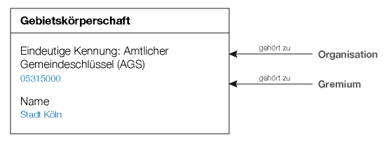

Datenmodell
===========

Das Datenmodell soll die Bausteine für die später zu entwerfende Schnittstelle definieren. Im folgenden werden sozusagen die Objekttypen bzw. die Klassen beschrieben, auf die über eine spätere API zugegriffen werden kann.

Einige Objekte werden eine eindeutige Identifizierung (ID) benötigen, wobei „eindeutig“ auch eine Frage des Kontextes ist. In den wenigsten Fällen wird es notwendig sein, eine Objekt-Kennung weltweit eindeutig zu machen. Darüber hinaus wird zu entscheiden sein, ob IDs unveränderlich oder veränderlich sein sollen.

Die Hinweise auf die Praxis in bestehenden Ratsinformationssystemen beziehen sich auf nach außen, bei Nutzung der Weboverfläche, feststellbare Eigenschaften. Es wird auf die folgenden Systeme Bezug genommen:

* Stadt Köln [2] - Plattform: Somacos SessionNet [3]
* Bezirksverwaltung Berlin Mitte [4] - Plattform: ALLRIS [5]
* Stadt Rösrath [6] - Plattform der Firma PROVOX [7]
* Stadt Euskirchen [8] - Plattform: SD.NET RIM 4 [9]
* Stadt Bonn - BoRis [10]

### Zu den Eigenschaften ###

Eigenschaften der einzelnen Objekttypen sind, wenn nicht anders angegeben, verpflichtend. Optionale Eigenschaften sind entsprechend gekennzeichnet.

Durch die aktuelle Detailtiefe der Beschreibungen soll vor allem die Frage "Was soll/kann gespeichert bzw. ausgedrückt werden?" geklärt werden.

Detailliertere Anforderungen an die Eigenschaften ("Wie genau soll eine Information gespeichert werden?") werden zu einem späteren Zeitpunkt erörtert.

### Zu den Beziehungen ###

Bei Beschreibung der Beziehungen zwischen Objekten wird zu diesem Zeitpunkt nicht berücksichtigt, ob eine Beziehung zwischen zwei Objekten A und B am Objekt A oder am Objekt B definiert wird. So spielt es bislang keine Rolle, ob einem Gremium mehrere Personen zugeordnet werden oder einer Person mehrere Gremien zugewiesen werden. Das Augenmerkt liegt hier nur auf der Tatsache, welche Beziehung existieren können und was diese Beziehungen aussagen sollen.

Gebietskörperschaft
-------------------

Die Gebietskörperschaft erlaubt es, Körperschaften wie einen bestimmten Landkreis, eine bestimmte Gemeinde oder einen bestimmten Stadtbezirk in Form eines Datenobjekts abzubilden.

Viele RIS werden nur genau eine Instanz dieses Typs „beherbergen“. Denkbar ist aber auch, dass Systeme für einen Verbund von mehreren Körperschaften betrieben werden.

### Eindeutige Identifizierung ###

Zur Identifizierung des Objekts kann der Amtliche Gemeindeschlüssel (AGS[1]) verwendet werden, der alle deutschen Gemeinden, Landkreise, kreisfreien Städte etc. eindeutig erfasst.

Vorteil der Verwendung des AGS:

* Kompakte, einfache und einheitliche Schreibweise für jede Körperschaft.
* Der AGS wird von Behörden genutzt, ist anerkannt und auch in anderen Medien, z.B. der Wikipedia, verbreitet.

Nachteil des AGS:

* Führende Nullen machen den Schlüssel fehleranfällig. Bestimmte Systeme wie z.B. Excel könnten den Inhalt als Zahlenwert erkennen und die führenden Nullen automatisch verwerfen.
* Für Gebietsgliederungen unterhalb der selbstständigen Gemeinde, beispielsweise einen einzelnen Stadtbezirk, gibt es keinen eigenen Gemeindeschlüssel. Dies müssten durch eine nicht-amtliche Erweiterung des Systems ausgeglichen werden.

### Eigenschaften ###

Name
:   Der Name der Gebietskörperschaft, z.B. "Köln" oder "Stadt Köln".

### Beziehungen ###

* Objekte vom Typ "Organisation" sind zwingend genau einer Gebietskörperschaft zugeordnet. So wird beispielseise eine SPD in Köln von einer SPD in Leverkusen unterschieden.
* Objekte vom Typ "Gremium" sind zwingend einer genau einer Gebietskörperschaft zugeordnet. Damit wird der "Rat" einer bestimmten Kommune von den gleichnamigen Gremien anderer Kommunen abgegrenzt.

Gremium
-------

Das Gremium ist ein Personenkreis, üblicherweise von gewählten und/oder ernannten Mitgliedern. Beispiele hierfür sind der Stadtrat, Kreisrat, Gemeinderat, Ausschüsse und Bezirksvertretungen. Gremien halten Sitzungen ab, zu denen die Gremien-Mitglieder eingeladen werden.

### Eigenschaften ###

Kennung
:   Zur eindeutigen Identifizierung des Gremiums im Kontext einer bestimmten Gebietskörperschaft. Die Stadt Köln verwendet beispielswiese das Kürzel "STA" für den Stadtentwicklungsausschuss oder "BA" für den Ausschuss für Anregungen und Beschwerden. Andere Kommunen verwenden z.B. rein numerische Kennungen.
Name
:   Der Name des Gremiums. Beispiele: "Rat", "Hauptausschuss", "Bezirksvertretung 1 (Innenstadt)"

#### Anmerkungen ####

Beim Rösrather RIS [6] wird für jedes Gremium ein Kurz- und ein Langname angegeben. Beispielsweise wird beim "Stadtentwicklungs-, Planungs- und Verkehrsausschuss" die kurze Form "Stadtentwicklung" hinterlegt. Bei 5 von 12 Gremien sind jedoch Kurz- und Langnamen identisch.

Sofern nicht Beispiele aus weiteren Systemen vorliegen, wird dieser Einzelfall nicht im Entwurf abgebildet.

### Beziehungen ###

* Objekte vom Typ "Person" referenzieren auf Gremien, um die Mitgliedschaft/Zugehörigkeit einer Person im/zum Gremium zu kennzeichnen.
* Objekte vom Typ "Drucksache" können einem Gremium zugeordnet sein. Beispielsweise wird eine Anfrage oder ein Antrag dem Rat oder einer bestimmten Bezirksvertretung zugeordnet.

Person
------

Jede natürliche Person, die Mitglied eines Gremiums ist, ist als Person im Datenmodell eindeutig identifizierbar.

### Eigenschaften ###

Kennung
:   Zur eindeutigen Identifizierung sollte jede Person eine Kennung besitzen, die keinen Änderungen unterworfen ist und aus diesem Grund nicht mit dem Namen in Verbindung stehen sollte. Viele RIS nutzen rein numerische Kennungen.
Vorname
:   Der Vorname der Person.
Nachname
:   Der Nachname der Person.
Titel
:   _Optional_. Akademische Titel wie "Dr." und "Prof. Dr."
Geschlecht
:   _Optional_. Männlich/Weblich
Berufsbezeichnung
:   _Optional_. Z.B. "Rechtsanwalt"
Partei
:   _Optional_. Z.B. "Bündnis 90/Grüne"
E-Mail-Adresse
:   _Optional_.
Telefon
:   _Optional_.
Fax
:   _Optional_.
Anschrift
:   _Optional_. Straße und Hausnummer, Postleitzahl und Ort

#### Anmerkungen ####

* Das System von Euskirchen scheint Vor- und Nachname (evtl. einschl. Titel) in einem gemeinsamen Feld "Name" zu führen. Ob das System hier technisch differenziert, ist unklar. Falls einzelne Systeme den angezeigten Namen nur als ganzes Speichern, sollte dies für den Standard übernommen werden, da es für die meisten Anwendungen ausreichen sollte.
* Das Rösrather System kennzeichnet, ob Anschriften privat oder geschäftlich sind.

### Beziehungen ###

* Objekte vom Typ "Person" können einer Organisation, z.B. einer Fraktion, zugeornet werden. Diese Beziehung ist datiert.
* Objekte vom Typ "Person" können einem oder mehreren Gremien zugewiesen werden, um die Mitgliedschaft in diesem Gremium darzustellen. Diese Beziehungen sind ebenfalls datiert.

Organisation
------------

Organisationen sind üblicherweise Parteien bzw. Fraktionen, denen die Personen angehören können.

### Eigenschaften ###

Kennung
:   Zur eundeitigen Kennzeichnung einer Organisation innerhalb einer Gebietskörperschaft
Name
:   Der gebräuchliche Name der Organisation, z.B. "SPD" oder "DIE LINKE".

#### Anmerkungen ####

* Unklar ist bislang, ob Organisationen in der Praxis eher Fraktionen ("SPD-Fraktion im Kölner Rat", "SPD-Fraktion in Köln-Innenstadt") abbilden oder ob eher Ortsverbände von Parteien ("SPD Köln") gemeint sein werden. Einblicke, wie gängige Systeme dies handhaben, sollten gesammelt und berücksichtigt werden.

### Beziehungen ###

* Jede Organisationen gehört zu einer Gebietskörperschaft.
* Personen können Organisationen angehören (*datiert*).

Sitzung
-------

Eine Sitzung ist die Versammlung der Mitglieder eines Gremiums zu einem bestimmten Zeitpunkt. Sitzungen können eine laufende Nummer haben.

Die geladenen Teilnehmer der Sitzung sind jeweils als „Person“ in entsprechender Form referenziert. Verschiedene Drucksachen (Einladung, Ergebnis- und Wortprotokoll) werden ebenfalls referenziert.

### Eigenschaften ###

Kennung
:   Zur eindeutigen Identifizierung der Sitzung innerhalb einer Gebietskörperschaft. In der Praxis wird eine solche Kennzeichnung entweder durch eine laufende Nummer gebildet, oder durch Kombination mehrerer Merkmale wie dem Kürzel des Gremiums, der laufenden Nummer der Sitzung in einem Jahr und der Jahreszahl (z.B. "BV1/0034/2012").
Nummer
:   _Optional_. Laufende Nummer der Sitzung, üblicherweise innerhalb der Wahlperiode mit 1 beginnend. In der Praxis wird dadurch z.B. die "2. Sitzung des Rats" gekennzeichnet.
Anfang
:   Datum und Uhrzeit des Anfangs der Sitzung
Ende
:   _Optional_. Datum und Uhrzeit vom Ende der Sitzung

#### Anmerkung ####

* Unklar ist, ob der Anfangszeitpunkt besser durch zwei getrennte Felder kodiert werden sollte: Anfangs-Datum (als Pflichtfeld) und Anfangs-Uhrzeit als optionales Feld. Dadurch könnten zukünftige Sitzungen, deren Uhrzeit noch nicht feststeht, korrekt abgebildet werden. Es müsste geprüft werden, ob dies in der Praxis relevant ist.

### Beziehungen ###

* Sitzungen sind grundsätzlich genau einem Gremium zugeordnet.
* Personen sind Sitzungen zugeordnet, um die Teilnahme an der Sitzung auszudrücken.
* Drucksachen werden vom Typ "Sitzung" _optional_ zu mehreren zwecken referenziert:
    * Zum Verweis auf die Einladung zur Sitzung
    * Zum Verweis auf das Ergebnisprotokoll zur Sitzung
    * Zum Verweis auf das Wortprotokoll zur Sitzung

Tagesordnungspunkt
------------------

Der Tagesordnungspunkt wird für eine bestimmte Sitzung angelegt, erhält eine (innerhalb dieser Sitzung eindeutige) Nummer und einen Titel (Betreff). Nach der Sitzung wird dem Tagesordnungspunkt außerdem ein Ergebnis angehängt. Falls abweichend von der ursprünglichen Beschlussvorlage (z.B. durch Berücksichtigung eines Änderungsantrags) kann ein bestimmter Beschlusstext zu Protokoll gegeben werden. Sofern das Abstimmungsergebnis nicht einstimmig ist, kann es durch mehrere referenzierende Stimmabgaben festgehalten werden.

In der Praxis werden die meisten Sitzungen mehrere Tagesordnungspunkte haben.

### Eigenschaften ###

Nummer
:   Beispiel: "1.2.3". Diese Nummer gibt an, in welcher Reihenfolge die Tagesordnungspunkte einer Sitzung behandelt werden. Im Kontext einer Sitzung ist diese Nummer eindeutig.
Öffentlich
:   ja/nein. Kennzeichnet, ob der Tagesordnungspunkt in öffentlicher Sitzung behandelt wird.
Titel
:   Das Thema des Tagesordnungspunktes
Ergebnis
:   Eines aus einer Liste definierter Ergebnisse. Möglich sind: "Unverändert beschlossen", "Geändert beschlossen", "Endgültig abgelehnt", "Zur Kenntnis genommen", "Ohne Votum in nachfolgende Gremien überwiesen"
Beschlusstext
:   _Optional_. Falls in diesem Tagesordnungspunkt ein Beschluss gefasst wurde, kann der Text hier hinterlegt werden. Das ist besonders dann in de Praxis relevant, wenn der gefasste Beschluss (z.B. durch Änderungsantrag) von der Beschlussvorlage abweicht.

#### Anmerkungen ####

* Einige Systeme vergeben zu Tagesordnungspunkten intern unveränderliche, numerische IDs. Es ist unklar, ob es zusätzlichen Nutzen bringt, derartige IDs, neben den Nummern, in den Standard zu übernehmen. Dies würde vermutlich nur Sinn ergeben, wenn es als Pflichtfeld gelten kann.

### Beziehungen ###

* Es können mehrere Objekte vom Typ "Stimmabgabe" referenziert werden, um das Abstimmungsverhalten von Fraktionen oder Einzelpersonen zu dokumentieren.
* Es können Personen referenziert werden, die während der Abstimmung zu diesem Tagesordnungspunkt *nicht* anwesend waren.

Stimmabgabe
-----------

Wie eine Person bzw. eine Fraktion zu einem Tagesordnungspunkt abgestimmt hat, wird durch eine Stimmabgabe festgehalten. Ganze Abstimmungsergebnisse bestehen überlicherweise aus mehreren Stimmabgaben. Jede Stimmabgabe gibt entweder die (einzelne) Stimme einer Peson wieder, in diesem Fall ist die Anzahl der Stimmen zwingend 1. Oder eine Stimmabgabe gibt das Abstimmungsverhalten einer ganzen Gruppe von Personen wieder. Dann ist die Anzahl der Stimmen anzugeben und statt einer Person eine Organisation (in der Regel die Fraktion) zu referenzieren.

### Eigenschaften ###

Anzahl der Stimmen
:   Gehört die Stimmabgabe zu einer Person, ist der Wert immer 1. Gehört sie jedoch zu einer Organisation (=Fraktion), kann der Wert hier größer als 1 sein.
Votum
:   Einer der drei Werte "ja" (gleichbedeutend mit "dafür"), "nein" ("dagegen") oder "Enthaltung".

### Beziehungen ###

* Jede Stimmabgabe gehört zu genau einem Tagesordnungspunkt.
* Es wird entweder genau eine Person oder genau eine Organisation (Fraktion) referenziert, die die Stimme(n) abgegeben hat.

Drucksache
----------

Eine Drucksache bildet Mitteilungen, Antworten auf Anfragen, Beschlussvorlagen, Anfragen und Anträge ab. Jede Drucksache erhält eine eindeutige Kennung.

Die Drucksache hat im Informationsmodell eine hervorgehobene Bedeutung. Im Fall eines Antrags kann mit einer einzigen Drucksache ein über Monate oder Jahre dauernder politischer Entscheidungsprozess verbunden sein. In dem Zusammenhang entstehen üblicherweise weitere Drucksachen.

Drucksachen spielen in der schriftlichen wie mündlichen Kommunikation eine besondere Rolle, da in vielen Texten auf bestimmte Drucksachen Bezug genommen wird. Hierbei kommen in Ratsinformationssystemen unveränderliche Kennungen der Drucksachen zum Einsatz.

Jede Drucksache ist über die Eigenschaft "Typ" als eine der folgenden Arten von Drucksachen gekennzeichnet:

* **Beschlussvorlage**: Entscheidungsvorschlag der Verwaltung
* **Antrag**: Entscheidungsvorschlag einer Fraktionen bzw. mehrerer Fraktionen oder einer/mehrerer Einzelperson/en
* **Anfrage**: Frage(n) einer oder mehrerer Fraktion oder Einzelpersonen an die Verwaltung
* **Mitteilung/Stellungnahme der Verwaltung**: Eine Information der Verwaltung an einzelne oder mehrere Gremien. Darunter fallen nicht Beantwortungen von Anfragen.
* **Beantwortung einer Anfrage**: Antwort der Verwaltung auf (mündliche oder schriftliche) Anfragen

### Eigenschaften ###

Kennung
:   Die Kennung einer Drucksache muss für die jeweilige Gebietskörperschaft eindeutig sein. Sie kann sowohl Ziffern als auch Buchstaben enthalten. Einige Systeme (z.B. Köln) verwenden besondere Trennzeichen wie "/", um eine Jahreszahl von einer laufenden Nummer abzutrennen. Weiterhin werden mancherorts führende Nullen verwendet.
Datum
:   Datum der Veröffentlichung
Typ
:   Art der Drucksache (Erläuterung siehe oben)

### Beziehungen ###
* Es muss genau ein **Hauptdokument** (Objekttyp "Dokument") referenziert werden.
* Es können beliebig viele weitere Dokumente referenziert werden, die als nachgeordnete **Anlagen** zur Drucksache verstanden werden.
* Es kann ein **Gremium** genannt werden, dem die Drucksache zuzuordnen ist. Hier ist zu klären, inwiefern dies für einzelne Typen von Drucksachen verpflichten sein sollte. So sollte beispielsweise eine Anfrage grundsätzlich aus einem Gremium (z.B. Gemeinderat) stammen.
* Drucksachen können **Urhebern** zugewiesen werden. Im Fall von Mitteilungen der Verwaltung ist dies oft der Oberbürgermeister. Bei Anträgen oder Anfragen können Organisationen oder Einzelpersonen referenziert werden. Es können stets mehrere Ihrheber verknüpft werden.
* Es können beliebig viele **Orte** (siehe Objekttyp "Ort") referenziert werden, die im Inhalt der Drucksache behandelt werden. Beispiel: Beschlussvorlage zur Freigabe von Mitteln für die Sanierung eines Sportplatzes, wobei der Ort die Lage des Sportplatzes genau beschreibt.
* Beim Drucksachen-Typ "Beantwortung einer Anfrage" ist die Drucksache zu referenzieren, die die ursprüngliche **Anfrage** beinhaltet.
* Drucksachen können zu beliebig vielen Tagesordnungspunkten in Beziehung stehen, um die **Beratungsfolge** einer Drucksache abzubilden. Hierbei kann die Beziehung jeweils mit einer Rollenbezeichnung versehen sein, die noch näher zu bestimmen ist (TODO).

Dokument
--------

Ein Dokument hält die Daten und Metadaten einer Datei vor, beispielsweise einer PDF-Datei, eines RTF- oder Word-Dokuments. Wird von einem Word-Dokument eine PDF-Ableitung hinterlegt, ist diese Ableitung ebenfalls ein Dokument, das jedoch nicht als Master gekennzeichnet wird, sondern auf den entsprechenden Master verweist.

Im Unterschied zur Drucksache benötigt das Dokument keine nutzerfreundliche Kennung.

### Eigenschaften ###
Kennung
:   Unveränderliche Kennung
Titel
:   Nutzerfreundliche Bezeichnung des Dokuments
Dateityp
:   Mime-Typ des Inhalts, z.B. "application/x-pdf"
Veröffentlichungsdatum
:   Datum des Tages, an dem das Dokument ins System eingestellt wurde
Änderungsdatum und -uhrzeit
:   Datum und Uhrzeit der letzten Änderung des Dokuments
Prüfsumme
:   SHA1-Prüfsumme des Dokumenteninhalts
Daten
:   Der eigentliche (Binär-)Inhalt des Dokuments
Nur-Text-Version
:   Reine Text-Wiedergabe des Dokumenteninhalts, sofern es sich um ein Textdokument handelt.

### Beziehungen ###

* Dokumente gehören zwingend zu einer **Drucksache**, optional auch zu mehreren. Ein Dokument kann entweder als Hauptdokument einer Drucksache oder als Anlage eingestuft sein.
* Ein Dokument kann auf ein anderes Dokument referenzieren, wenn es von dem anderen Dokument abstammt. So ist es möglich, von einem abgeleiteten Dokument zu seinem Dokumenten-Master zu gelangen (Beispiel: von einem PDF-Dokument zum OpenOffice-Original).

Ort
---

Dieser Objekttyp dient dazu, einen Ortsbezug einer Drucksache formal abzubilden. Ortsangaben können sowohl aus Textinformationen bestehen (beispielsweise der Name einer Straße/eines Platzes oder eine genaue Adresse) oder aus einer Geo-Koordinatenangabe aus Längen- und Breitengrad.

Bislang finden sich nur beim Bonner System Beispiele für Ortsangaben.

### Eigenschaften ###

Textanabe
:   _Optional._ Textliche Beschreibung eines Orts, z.B. in Form einer Adresse
Längen- und Breitenangabe
:   _Optional._ Längen- und Breitenangabe des Orts im WGS-84-System [11]

### Eigenschaften ###
* Orte können mit Drucksachen in Verbindung stehen.

Noch nicht abgedeckt
--------------------

* Angaben von Personen zu Tätigkeiten (z.B. Auskunft nach § 17 Korruptionsbekämpfungsgesetz). Diese werden von mehreren Systemen geführt und ausgegeben.
* Änderungsdatum (bei allen Objekttypen relevant)
* Unterscheidung von Rollen bzw. Zuständigkeiten zwischen Drucksachen und Tagesordnungspunkten (z.B. federführende Beratung, konsultierende Beratung etc.)
