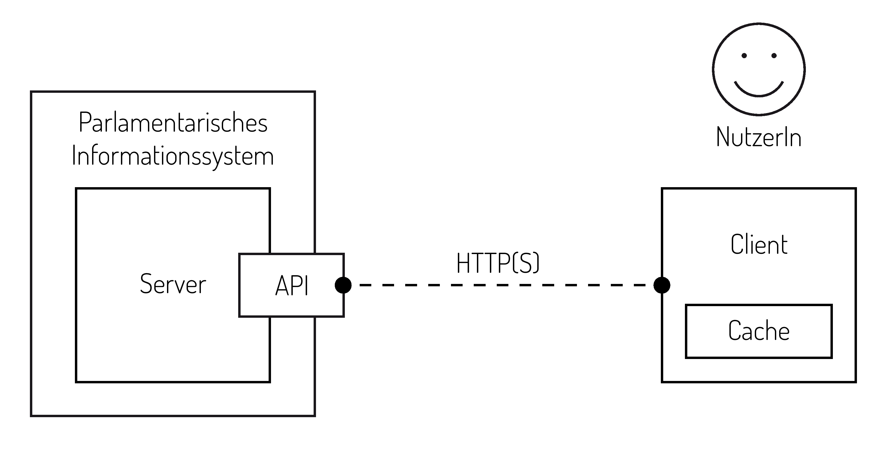

Architektur  {#architektur}
===========

In diesem Abschnitt werden grundlegenden Konzepte, die von OParl abgedeckt
werden, erläutert. Die Erläuterungen sind nicht im engeren Sinne Teil der
Spezifikation, sondern dienen dazu, die Anwendungsbereiche von OParl und die
Funktionen einer OParl-konformen API verständlicher und konkreter beschreiben
zu können.

Da die Architektur auf der generellen Architektur des World Wide Web (WWW)
aufbaut, sind einzelne Konzepte direkt den Begriffen der
Architekturbeschreibung des W3-Konsortiums entlehnt.^[Architecture of the World Wide Web, Volume One. <http://www.w3.org/TR/webarch/>]

Überblick
---------

Parlamentarisches Informationssystem {#parlamentarisches_infosystem}
------------------------------------

Parlamentarische Informationssysteme sind Software-Systeme, die von
verschiedensten Körperschaften eingesetzt werden, um die Zusammenarbeit
von Parlamenten zu organisieren, zu dokumentieren und öffentlich nachvollziehbar
zu machen. Zu den Körperschaften können beispielsweise Kommunen, Landkreise,
Regierungsbezirke und Zweckverbände gehören.

Diese Systeme unterstützen in der Regel mehrere der folgenden Funktionen:

* Das Erzeugen, Bearbeiten und Darstellen von Sitzungen und deren Tagesordnung
* Das Erzeugen und Abrufen von Sitzungsprotokollen
* Das Erzeugen, Bearbeiten und Anzeigen von Drucksachen
* Das Erzeugen, Bearbeiten und Anzeigen von Gremien und deren Mitgliedern

Funktionen, die die Eingabe und Bearbeitung von Daten betreffen, sind in der
Regel einem geschlossenen Nutzerkreis vorbehalten. Die Darstellung und der Abruf
von Informationen und Dokumenten hingegen ist in vielen Fällen für die
Öffentlichkeit freigegeben.

Die OParl-Spezifikation beschreibt eine Schnittstelle, die den maschinellen,
lesenden Zugriff auf derartige Informationen ermöglicht.

Server {#server}
------

Der Server im Sinne dieser Spezifikation ist ein Software-Dienst, der auf einem
mit dem Internet verbundenen Rechnersystem läuft. Dieser Dienst ist eine spezielle
Form eines WWW- bzw. HTTP(S)-Servers. Entsprechend beantwortet der Server
HTTP-Anfragen, die an ihn auf einem bestimmten TCP-Port gestellt werden.

Der Server ist als Bestandteil des parlamentarischen Informationssystems zu
verstehen. Der Betrieb des Servers steht damit üblicherweise in der Verantwortung
desjenigen, der das parlamentarischen Informationssystem betreibt.

Von einem Server, der die OParl-Spezifikation erfüllt, wird erwartet, dass er
bestimmte parlamentarische Informationen in einem bestimmten Format zur Verfügung
stellt und auf bestimmte Anfragen von so genannten Clients über die OParl-API
entsprechend dieser Spezifikation reagiert.

API {#api}
---

Der Begriff API steht in diesem Dokument für die Webservice-Schnittstelle, die der
Server anbietet. Die Schnittstelle basiert auf dem HTTP-Protokoll. Mittels HTTPS
ist die verschlüsselte Nutzung der API möglich, sofern Server dies
unterstützen.

Die API steht im Mittelpunkt dieser Spezifikation. Server und Clients sind
als Kommunikationspartner zu verstehen, die über das Internet als Kommunikationskanal
mit einander kommunizieren können. Die API-Spezifikation stellt dabei die
nötige Grammatik und das Vokabular bereit, anhand dessen eine sinnvolle Kommunikation
erfolgen kann.

Client {#client}
------

Der Begriff "Client" steht für eine Software, die über die OParl-API mit dem Server
kommuniziert. Da die API auf dem HTTP-Protokoll aufbaut, handelt es sich bei dem
Client um eine spezielle Form eines HTTP-Clients.

Cache {#cache}
-----

Ein Cache ist ein Speicher, der einem Client dazu dienen kann, von einem
Server abgerufene Informationen längerfristig vorzuhalten. Dies kann beispielsweise
dazu dienen, mehrfache Anfragen der selben Informationen zu vermeiden, wodurch
sowohl Ressourcen auf Seite des Servers geschont als auch die Nutzung von
Netzwerkbandbreite reduziert werden kann. Die Nutzung eines Cache kann auch
zur Verbesserung der Nutzerfreundlichkeit eines Clients beitragen, indem
Wartezeiten zur Bereitstellung einer Ressource verkürzt werden.

Nutzerin oder Nutzer {#nutzerin}
--------------------

Mit einer Nutzerin oder einem Nutzer ist in diesem Fall eine natürliche Person gemeint,
die mittels eines OParl-Clients auf parlamentarische Informationen zugreift.

Objekt  {#objekt}
------

Der Server beantwortet Anfragen eines Clients im Regelfall, indem bestimmte Objekte
ausgegeben werden. Objekte sind im Fall einer OParl-konformen API JSON-Objekte, die
das Schema einhalten, das in der vorliegenden Spezifikation beschrieben wird.
Antworten des Servers können einzelne Objekte, Listen von Objekten oder Listen von
URLs von Objekten enthalten.
