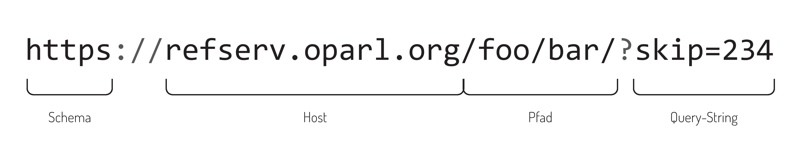

URLs, IRIs und URIs  {#urls}
-------------------

Den URLs (für _Uniform Resource Locators_)
kommt bei einer OParl-konformen API eine besondere Bedeutung zu und es werden eine 
Reihe von Anforderungen an die Verarbeitung von URLs gestellt.

Im Rahmen dieses Dokuments wird aus Gründen der Verständlichkeit generell der allgemein
gebräuchliche Begriff _URL_ werwendet, auch wenn damit tatsächlich die
internationalisierte Variante nach RFC 3987^[RFC 3987: 
<http://tools.ietf.org/html/rfc3987>], die korrekterweise _IRI_ bzw. _Internationalized
Resource Identifier_ genannt werden müsste, gemeint ist. Einige Quellen wiederum nutzen den
Begriff _URI_ bzw. _Uniform Resource Identifier_. Das vorliegende Dokumente fasst
alle drei Konzepte mit dem Begriff _URL_ zusammen und ignoriert damit die
Unterschiede der einzelnen Begriffe, da diese im Rahmen dieser Spezifikation nicht von
Bedeutung sind.

Die grundsätzliche Funktionsweise von URLs ist in RFC 3986 
beschrieben^[RFC 3986: <http://tools.ietf.org/html/rfc3986>]. Darauf aufbauend sind
hier die Bestandteile einer beispielhaften URL mit den Bezeichnungen beschriftet, 
mit denen sie in diesem Dokument benannt werden:

Der optionale _Query-String_ besteht dabei aus beliebig vielen _Query-Parametern_, die
jeweils einen Namen (links des Gleichheitszeichens) und einen Wert haben können.

### URL-Kanonisierung {#url_kanonisierung}

Absicht ist, dass jedes benannte Objekt^[vgl. [Benannte und anonyme Objekte](#benannte_anonyme_objekte)], das ein Server über eine OParl-API anbietet, über genau
eine URL identifizierbar und abrufbar ist. Diese Vereinheitlichung der URL wird
nachfolgend _Kanonisierung_ genannt.

Die Kanonisierung ist entscheidend, um erkennen zu können, ob zwei URLs das selbe
Objekt repräsentieren. Sind zwei URLs identisch, sollen Clients daraus ableiten können,
dass diese das selbe Objekt repräsentieren. Sind zwei URLs unterschiedlich, soll
im Umkehrschluss die Annahme gelten, dass sie zwei verschiedene Objekte repräsentieren.

Der OParl-konforme Server MUSS für jedes benannte Objekt eine kanonische URL bestimmen können.

Die URL-Kanonisierung betrifft sämtliche Bestandteile der URL. Entsprechend beginnt diese
schon beim **Schema** und bei der Entscheidung durch den Betreiber, ob eine OParl-API regulär
über HTTP oder über HTTPS erreichbar sein soll (vgl. [HTTP und HTTPS]).

Der **Host**-Teil der URL wird ebenfalls durch die Konfiguration des Betreibers festgelegt.
Obwohl technisch auch die Verwendung einer IP-Adresse (z.B. "123.123.123.123") möglich wäre,
SOLL der Betreiber einen mit Bedacht gewählten Host-Namen einsetzen. Die Vorteile dieser Lösung
gegenüber der Verwendung einer IP-Adresse sind vielfältig:

* Nutzerinnen können Host-Namen lesen und interpretieren
* In Kombination mit der richtigen Domain (oder Subdomain) kann der Hostname
  kommunizieren, wer der Betreiber ist.
* Host-Namen können zwischen verschiedenen technischen Systemen (bzw. von IP-Adresse zu IP-Adresse)
  migriert werden, was hilft, die Langlebigkeit der URLs zu gewährleisten

Eine URL wie

    http://oparl.stadtrat.stadt-koeln.de/

kommuniziert beispielsweise direkt die Zugehörigkeit zur Stadt Köln als Betreiber des Systems. Die
Bezeichnung "stadtrat" in der Subdomain zeigt den Zweck des Systems allgemein verständlich an.
Der Host-Name "oparl.stadtrat.stadt-koeln.de" deutet an, dass diese URL zu einer 
OParl-Schnittstelle zu diesem System gehört. Eine technische Notwendigkeit zur Verwendung einer
eigenen Domain für OParl besteht jedoch nicht, da JSON-LD Dokumente und HTML-Seiten
mittels Content Negotiation über eine gemeinsame Domain ausgeliefert werden können.

Um die Kanonisierung zu gewährleisten, SOLLEN Betreiber alle Möglichkeiten ausschließen,
die dazu führen können, dass eine Ressource neben der kanonischen URL noch über andere URLs
abrufbar ist. Diese Faktoren können sein:

* Der selbe Server antwortet nicht nur über den kanonischen Host-Namen, sondern auch noch über andere
  Host-Namen. Das könnte zum Beispiel der Fall sein, wenn der Host-Name als CNAME für einen anderen
  Namen konfiguriert wurde oder wenn ein DNS A-Record für die IP-Adresse des Servers existiert.

* Der Server ist neben dem Host-Namen auch über die IP-Adresse erreichbar.

* Zusätzliche Domains, die einen A-Record auf den selben Server besitzen

Zu der kanonischen Beispiel-URL https://oparl.stadtrat.stadt-koeln.de/ wären 
eine Reihe von nicht-kanonischen URL-Varianten denkbar, die technischen auf 
den selben Server führen könnten:

* https://83.123.89.102/
* https://oparl.stadtrat.stadtkoeln.de/
* https://risserv.stadt-koeln.de/

Falls es aus technischen Gründen nicht möglich ist, den Zugang auf das OParl-System über nicht-kanonische
URLs zu unterbinden, SOLL eine entsprechende HTTP-Anfrage mit einer Weiterleitung auf die entsprechende 
kanonische URL beantwortet werden. Dabei ist der HTTP-Status-Code 301 zu verwenden.

Server-Implementierern wird empfohlen, hierfür den `Host`-Header der HTTP-Anfrage auszuwerten und mit
der konfigurierten Einstellung für den kanonischen Host-Namen des Systems abzugleichen.

Beim **Pfad**-Bestandteil der URL MÜSSEN Server-Implementierer darüber hinaus beachten, dass
nur jeweils eine Schreibweise als die kanonische Schreibweise gelten kann. Dazu gehört auch
die Groß- und Kleinschreibung, die Anzahl von Schrägstrichen als Pfad-Trennzeichen, die Anzahl
von führenden Nullen vor numerischen URL-Bestandteilen und vieles mehr.

Die Kanonisierung umfasst auch den **Query-String**-Bestandteil der URL. Wie auch beim Pfad, gilt hier,
dass für jeden Parameter und jeden Wert im Query-String nur eine kanonische Schreibweise gelten MUSS.

Darüber hinaus SOLL der Server-Implementierer darauf achten, bei Verwendung von Query-String-Parametern
diese in URLs immer nach dem selben Prinzip zu sortieren. Ein Beispiel: die beiden URLs

    https://oparl.example.org/members?body=1&committee=2
    https://oparl.example.org/members?committee=2&body=1

unterscheiden sich lediglich in der Reihenfolge der Query-String-Parameter. Da sie jedoch nicht
identisch sind, müssen Clients annehmen, dass beide URLs verschiedene Objekte repräsentieren. In der
Konsequenz kann es zu vermeidbarer Ressourcennutzung sowohl auf Client- als auch auf Serverseite kommen.

Von Clients wird erwartet, dass sie die URLs, die ihnen von Servern angeboten werden,
unverändert verwenden. Clients SOLLEN NICHT versuchen, Schreibweisen von URLs zu ändern,
Query-String-Parameter umzusortieren oder Ähnliches.

### Langlebigkeit

Weiterhin ist es Absicht, dass URLs von Objekten langlebig sind, so dass sie, wenn sie einmal 
verbreitet wurden, langfristig zur Abfrage des dazugehörigen Objekts verwendet werden können.

Um dies zu gewährleisten, wird den **Betreibern** empfohlen, die Wahl der Domain, eventuell der
Subdomain und letztlich des Host-Namens sorgfältig auf seine längerfristige Verwendbarkeit abzuwägen.

**Server-Implementierer** SOLLEN darüber hinaus dafür sorgen, dass der Pfad-Bestandteil der URLs
die Langlebigkeit der URLs unterstützt. Es gelten die folgenden Empfehlungen, die jedoch keinen
Anspruch auf Vollständigkeit erheben:

* **Veränderliche Objekt-Eigenschaften nicht als URL-Bestandteil nutzen.** In URLs sollten nur Eigenschaften
  des Objekts aufgenommen werden, die keinen Veränderungen unterliegen. Ändert sich beispielsweise
  die Kennung einer Drucksache im Verlauf ihrer Existenz, dann scheidet sie für die Bildung
  der URL aus.

* **Technische Eigenschaften der Implementierung verbergen.** Ist ein OParl-Server beispielsweise in PHP
  implementiert, sollte dies nicht dazu führen, dass im Pfad ein Bestandteil wie "oparl.php/" erscheint.
  Erfahrungsgemäß überdauern solche URLs nur kurz.

Weitere Empfehlungen für langlebige URLs liefern Tim Berners-Lee^[Berners-Lee, Tim: Cool URIs don't change. <http://www.w3.org/Provider/Style/URI.html>] sowie die Europäische Kommission^[Study on persistent URIs, with identification of 
best practices and recommendations on the topic for the MSs and the EC. (PDF) <https://joinup.ec.europa.eu/sites/default/files/D7.1.3%20-%20Study%20on%20persistent%20URIs.pdf>].
