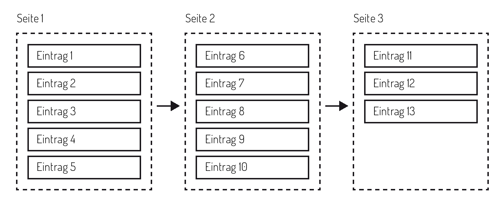

Objektlisten  {#objektlisten}
------------

Über die OParl-API können entweder einzelne (benannte) Objekte,
beispielsweise eine bestimmte Drucksache, oder Listen von Objekten,
etwa die Liste aller Sitzungen einer Körperschaft, abgefragt werden.

Es gibt mehrere Möglichkeiten, Listen von Objekten auszugeben. Welche
gewählt wird, hängt von verschiedenen Kriterien ab, die nachfolgend
beschrieben werden.

In jedem Fall werden die einzelnen Objekte, die Bestandteile der
Liste sind (wie z. B. die einzelnen Drucksachen) durch die URL
des jeweiligen Objekts repräsentiert. Objektlisten sind also 
tatsächlich immer Listen von URLs.

### Vollständige Listenausgabe

In der einfachsten Form wird eine Objektliste als JSON-Liste ausgegeben.
Die Elemente dieser nicht geordneten Liste (Menge) sind **sämtliche URLs** aller
in der Objektliste enthaltenen Objekte.

Beispiel:

~~~~~  {#objektlisten_ex1 .json}
{
    "@context": {
        "beispielris": "https://oparl.example.org/",
        "hydra": "http://www.w3.org/ns/hydra/core#",
        "prov": "http://www.w3.org/ns/prov#",
        "xsd": "http://www.w3.org/2001/XMLSchema#",
        "generatedAt": {
            "@id": "prov:generatedAtTime",
            "@type":"xsd:dateTime"
        },
        "member": {
            "@id": "hydra:member",
            "@type": "@id"
        }
    },
    "@id": "beispielris:collection2345",
// TODO: @id ZWINGEND, OPTIONAL, EMPFOHLEN ?
    "@type": "hydra:Collection",
    "generatedAt": "2014-06-11T12:59:11.038+0100",
    "member": [
        {
            "@id": "beispielris:bodies/0/papers/2",
            "@type": "oparl:Paper"
        },
        {
            "@id": "beispielris:bodies/0/papers/5"
            "@type": "oparl:Paper"
        },
        {
            "@id": "beispielris:bodies/0/papers/7"
            "@type": "oparl:Paper"
        }
    ]
}
~~~~~

Die vollständige Listenausgabe SOLL nur für Listen verwendet
werden, die bis zu 100 Einträge umfassen. Links zu solch kurzen Listen
wir jedoch in OParl-Objekten in der Regel nicht enthalten.

### Paginierung  {#paginierung}

Für den Abruf von Listen mit vielen Elementen ist eine Blätterfunktion
(Paginierung) vorgesehen. Darunter verstehen wir die Aufteilung einer Liste
in kleinere Teilstücke, die wir hier als Listenseiten bezeichnen.
Jede Listenseite wird vom Client jeweils mit einer eigenen API-Anfrage
abgerufen. Das dient dazu, die bei der jeweiligen Anfrage übertragenen
Datenmengen zu begrenzen und damit Antwortzeiten und Systemressourcen
sowohl beim Server als auch beim Client zu schonen.

Die Entscheidung, ob eine Seite teilweise und daher mit Paginierung
ausgegeben wird, liegt allein beim Server. Bei Listen mit mehr als 100
Einträgen ist dies EMPFOHLEN. Die Zahl der Einträge, die der
Server dabei je Listenseite ausliefert, SOLL dabei maximal 100 betragen.
Die Anzahl der Einträge (Obergrenze) MUSS auf allen Listenseiten der selben
Liste einheitlich sein, sofern nicht (beispielsweise auf der letzten
Listenseite) weniger Listeneinträge vorhanden sind.

Wird eine Liste in Form von Listenseiten, also mit Paginierung, ausgegeben,
teilt der Server dem Client mittels HTTP-Headern in der nachfolgend
beschriebenen Form mit, unter welcher URL weitere Listenseiten
abgerufen werden können. Dabei wird von dem in RFC5988^[RFC5988:
<http://tools.ietf.org/html/rfc5988>] beschriebenen Header namens `Link`
Gebrauch gemacht.

Beispiel eines Link-Headers zur Angabe der URL für den Abruf der
folgenden Listenseite:

    Link: <https://oparl.example.org/bodies/0/papers/?skip_id=7>;rel=next

Im oben gezeigten Beispiel besteht der Wert des Link-Headers aus zwei
Bestandteilen, die durch ein Semikolon von einander getrennt sind:

    <https://oparl.example.org/bodies/0/papers/?skip_id=7>;rel=next
     \_____________________________________________________/  \______/
                                |                                |
                               URL                        Link-Parameter

Die Bestandteile sind:

URL:
:   Die URL zum Abruf der nächsten Listenseite. Die URL wird
    in spitzen Klammern, `<` und `>`, ausgegeben.
    *Hinweis:* Wie diese URL aufgebaut ist, entscheidet allein
    der Server. Hier wird lediglich ein fiktives Beispiel gegeben.

Link-Parameter:
:   Gemäß RFC5988 können beliebig viele, auch null, Link-Parameter
    hinter der URL ausgegeben werden, jeweils durch ein Semikolon
    von der URL getrennt. Für OParl gilt: Es MUSS bei einer Liste
    mit Paginierung genau ein Link-Header mit dem Link-Parameter
    `rel=next` gegeben sein, sofern es eine nächste Seite mit
    weiteren Listenelementen gibt. Stellt die mit der aktuellen
    Anfrage ausgegebene Listenseite das Ende der Liste dar, DARF
    die Anfrage NICHT den Link-Header mit Link-Parameter `rel=next`
    enthalten.

Es ergibt sich eine typische Abfolge, wie Clients bei Bedarf
mit mehreren Anfragen ganze Objektlisten vom Server abrufen:

1. Der Server stellt eine URL für eine Liste zur Verfügung.

2. Der Client ruft diese URL der Liste auf.

3. Der Server antwortet mit einer Listenseite und stellt im
   Link-Header mit Link-Parameter `rel=next` die URL für den
   Abruf der nächsten Listenseite zur Verfügung.

4. Der Client ruft die im Link-Header übergebene URL für
   die nächste Listenseite auf.

Die Punkte 3 und 4 können sich nun so oft wiederholen, bis
die letzte Listenseite erreicht ist.

5. Der Server liefert die letzte Listenseite ohne Link-Header
   aus.

Zusätzlich zu dem für die Paginierung obligatorischen Link-Header für
die folgende Listenseite (Link-Parameter `rel=next`) können Server
OPTIONAL weitere Link-Header zum Abruf bestimmter Listenseiten
anbieten:

Erste Listenseite (`first`):
:   Sofern die aktuell abgerufene Listenseite nicht den Anfang der
    Liste wiedergibt, KANN der Server einen Link-Header mit
    Link-Parameter `rel=first` und der URL zum Abruf der *ersten*
    Listenseite ausgeben.

Letzte Listenseite (`last`):
:   Sofern die aktuell abgerufene Listenseite nicht das Ende der
    Liste wiedergibt, KANN der Server einen Link-Header mit
    Link-Parameter `rel=last` und der URL zum Abruf der *letzten*
    Listenseite ausgeben.

Vorherige Listenseite (`prev`):
:   Sofern die aktuell abgerufene Listenseite nicht den Anfang der
    Liste wiedergibt, KANN der Server einen Link-Header mit
    Link-Parameter `rel=prev` und der URL zum Abruf der ersten
    Listenseite ausgeben.

Damit eröffnet der Server dem Client zusätzliche Möglichkeiten,
die einzelnen Listenseiten abzurufen.

Server-Implementierer entscheiden selbst, wie die URLs zum Abruf einzelner
Listenseiten aufgebaut sind und tragen damit selbst Verantwortung für die
Funktionsweise der Paginierung. Bei der Entscheidung für eine Form der
Implementierung sollten die folgenden Anforderungen von Clients
berücksichtigt werden.

Es ist davon auszugehen, dass Clients für den gesamten Abruf aller
Seiten einer Liste längere Zeit benötigen. In der Zwischenzeit kann sich
der Inhalt der Liste bereits ändern, etwa durch das Hinzukommen neuer
Einträge. Die Paginierung ist idealerweise so zu implementieren, dass sich
das Hinzukommen oder Entfernen von Einträgen möglichst nicht auf einen Client
auswirkt, der aktuell die Liste paginiert, um alle Einträge abzurufen. Wir
bezeichnen dies als **stabile Paginierung**.

Eine wesentliche Anforderung an Listen mit Paginierung ist, dass alle
Einträge der Liste in einer konsistenten Reihenfolge sortiert ausgegeben
werden SOLLEN. Das bedeutet, dass die Sortierung beim Server im Idealfall
anhand einer eindeutigen und unveränderlichen Objekteigenschaft vorgenommen
wird. Hierfür eignen sich die Objekt-URLs, da sie genau diese beiden
Anforderungen erfüllen sollten.

Über die Sortierung hinaus können bei der Implementierung einer stabilen 
Paginierung auf Server-Seite weitere Überlegungen einbezogen werden.
Zur Verdeutlichung soll hier eine ungünstige (unstabile) Form der
Implementierung mit Hilfe einer SQL-Abfrage illustriert werden. Gegeben sei
eine Tabelle `example`, die einen 
numerischen Primärschlüssel `id` enthält. Nehmen wir an, die erste Seite der 
Liste wird mit der Abfrage

~~~~~  {#objektlisten_ex3 .sql}
SELECT * FROM example ORDER BY id LIMIT 10 OFFSET 0
~~~~~

abgerufen und würde 10 Datensätze mit den `id`s 1 bis 10 zurückliefern. Dann wird
die zweite Seite mit der Abfrage

~~~~~  {#objektlisten_ex4 .sql}
SELECT * FROM example ORDER BY id LIMIT 10 OFFSET 10
~~~~~

abgerufen. Sollte nach der ersten, aber vor der zweiten Abfrage beispielsweise 
der Datensatz mit der `id=1` gelöscht worden sein, liefert die zweite Abfrage
Datensätze mit `id` > 9. In diesem Fall würde dies nur dazu führen, dass ein
Datensatz (`id=10`) zweimal ausgegeben wird. Bei ungünstigeren Konstellationen
wäre auch denkbar, dass eine unstabile Paginierung bewirkt, dass einzelne 
Datensätze beim Paginieren übergangen werden. Je nach Bedeutung der fehlenden
Datensätze können splche Inkonsistenzen erhebliche Auswirkungen haben.

Besser wäre es, bei der Paginierung die Eintragsgrenze, bei der eine Listenseite
beginnen soll, explizit zu benennen. Wurden auf der ersten
Listenseite die Datensätze mit den IDs 1 bis 10 ausgegeben, so könnte der
Folgeaufruf, um beim SQL-Beispiel zu bleiben, so aussehen:

~~~~~  {#objektlisten_ex5 .sql}
SELECT * FROM example WHERE id > 10 ORDER BY id LIMIT 10
~~~~~

Die zuvor beschriebenen Anforderungen für die Paginierung von Listen
gelten auch unverändert, wenn der Umfang der Liste durch Abfrageparameter
vom Client eingeschränkt wurde.

### Listen als Eigenschaften von Objekten

Listen von Objekten können auch als Werte von Objekteigenschaften
auftreten^[Genaugenommen ist dann nicht die Liste der Wert der
Eigenschaft, sondern jedes Element ist selbst Wert der Eigenschaft.].
Hierbei kann die oben beschriebene Paginierung nicht angewendet werden, sondern
es MÜSSEN die URLs aller Listeneinträge aufgelistet werden.

Ein Beispiel dafür könnte die Eigenschaft `body` des `oparl:System`-Objekts
sein, also die Liste der Körperschaften, die auf einem OParl-Server abgebildet
werden:

~~~~~  {#objektlisten_ex6 .json}
{
    "@type": "oparl:System",
    "@id": "https://oparl.example.org/",

    "body": [
        "https://oparl.example.org/bodies/1",
        "https://oparl.example.org/bodies/2"
    ],
    ...
}
~~~~~

Diese Listenausgabe direkt im Objekt ist nur zu empfehlen, wenn die Anzahl der
Einträge klein (weniger als 100 Einträge) ist. Sind mehr Einträge zu erwarten,
SOLL die entsprechende Liste über eine eigene URL angeboten werden.

Das folgende Beispiel verdeutlicht, wie die Ausgabe des vorangegangenen
Beispiel dann aussieht. Diese Konstruktion wurde durch
das Hydra Projekt erarbeitet^[<https://www.w3.org/community/hydra/wiki/Collection_Design>]:

~~~~~  {#objektlisten_ex7 .json}
{
    "@type": "oparl:System",
    "@id": "https://oparl.example.org/",

    "hydra:hasCollection": {
        "@id": "https://oparl.example.org/bodies/",
        "@type": "hydra:Collection",
        "hydra:manages": {
            "hydra:property": "body",
            "hydra:subject": "https://oparl.example.org/"
        }
    },
    ...
}
~~~~~

Die Konstruktion sieht auf den ersten Blick möglicherweise unnötig
komplex aus. Dies ist jedoch u.a. ein Ergebnis davon, dass die semantischen
Informationen so auch maschinenlesbar sind^[Eine Darstellung der Problematik: <https://www.w3.org/community/hydra/wiki/Avoid_that_collections_%22break%22_relationships#Problem_description>].

"hydra:property" hat als Wert den Namen der Eigenschaft, die
auf eine Liste verweisen soll.

Der Wert der `subject`-Eigenschaft muss identisch zum Identifikator
des äußeren Objekts (also des "Subjekts") sein. Dass
"https://oparl.example.org/" an zwei Stellen auftritt ist deshalb
zwingend.

"https://oparl.example.org/bodies/" verweist auf eine Objekt-Liste.^[Wie
in vielen anderen Fällen ist diese URL hier wieder nur beispielhaft. Die
tatsächliche Gestaltung des Pfads bestimmt der Server-Implementierer.]
