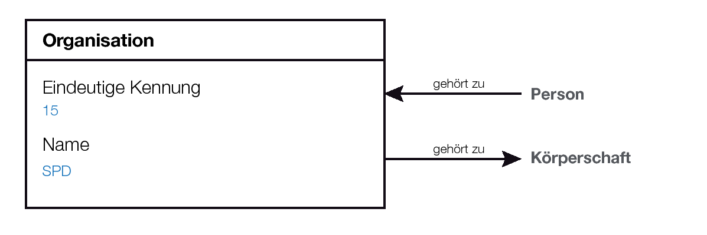
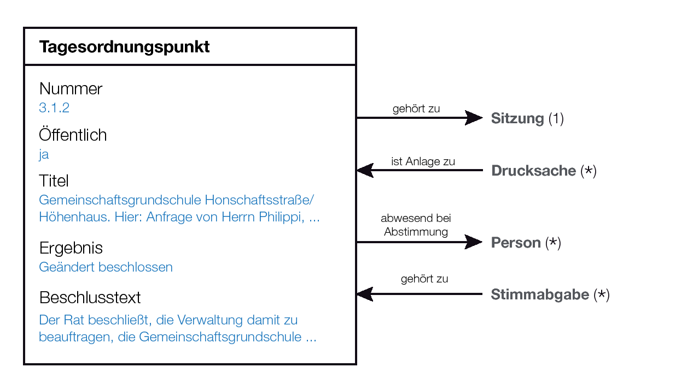
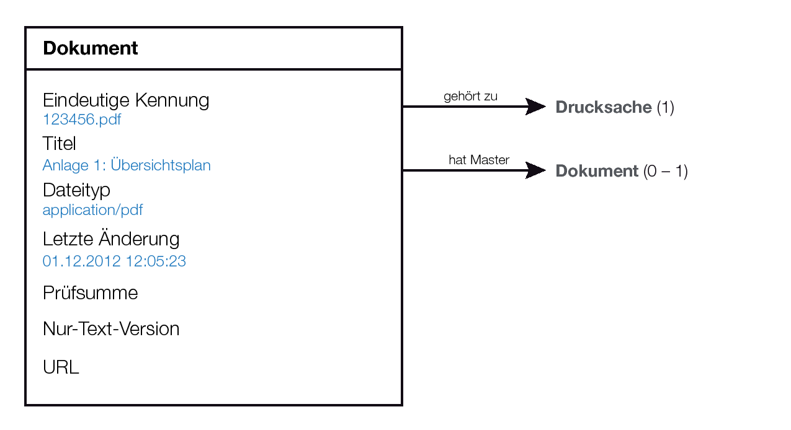
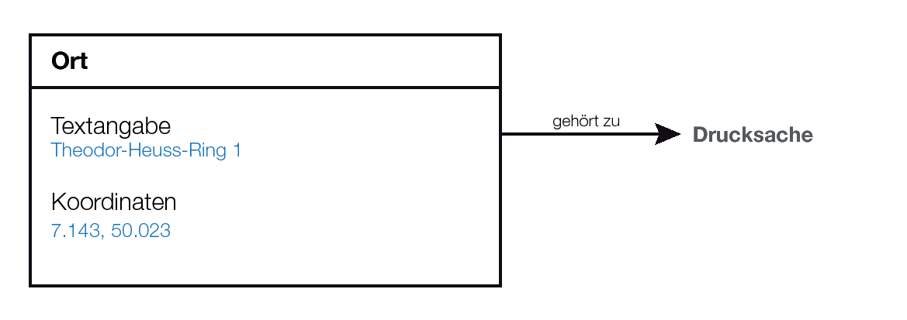

Datenmodell
===========

Das Datenmodell definiert die Objekttypen bzw. die Klassen, auf die über die 
Schnittstelle zugegriffen werden kann.

Die Hinweise auf die Praxis in bestehenden Ratsinformationssystemen beziehen 
sich auf nach außen, bei Nutzung der jeweiligen Weboberflächen, feststellbare 
Eigenschaften. Dabei wird vereinzelt und beispielhaft auf die folgenden 
Systeme Bezug genommen:

* Stadt Köln [2] - Plattform: Somacos SessionNet [3]
* Bezirksverwaltung Berlin Mitte [4] - Plattform: ALLRIS [5]
* Stadt Rösrath [6] - Plattform der Firma PROVOX [7]
* Stadt Euskirchen [8] - Plattform: SD.NET RIM 4 [9]
* Stadt Bonn - BoRis [10]

Übergreifende Aspekte
---------------------

### Eindeutige Identifizierung von Objekten ###

Sämtliche Objekte, die über die Schnittstelle geladen werden können, sollen 
anhand einer einzigen Objekteigenschaft eindeutig identifizierbar sein. Die 
Objekteigenschaft, mit der dies erreicht wird, wird hier im folgenden - 
unabhängig vom tatsächlichen Namen der Eigenschaft - als "Schlüssel" 
bezeichnet.

Eindeutigkeit meint hier eine Einzigartigkeit innerhalb des 
Informationssystems und für den jeweiligen Objekttyp. Das bedeutet: zwei von 
einander unabhängige Ratsinformationssysteme für verschiedene 
Körperschaften dürfen sich überlappende Schlüssel nutzen. Innerhalb 
eines Systems dürfen zwei Objekte unterschiedlichen Typs (beispielsweise 
eine Person ud ein Gremium) den selben Schlüssel nutzen. Jedoch MÜSSEN zwei 
Objekte des selben Typs innerhalb des selben Systems grundsätzlich 
verschiedene Schlüssel haben.

Schlüssel-Eigenschaften werden grundsätzlich als Unicode-Zeichenkette 
übergeben. Sie können daher gleichermaßen aus 
numerischen wie alphanumerischen Werten befüllt werden.

Es wird grundsätzlich vorausgesetzt, dass Schlüssel unveränderlich sind. 
Ändert sich der Schlüssel eines Objekts nach der Erzeugung, werden Nutzer 
der Schnittstelle annehmen, dass es sich nicht mehr um das selbe Objekt 
handelt.

### Objekteigenschaften ###

Die nachfolgend beschriebenen Eigenschaften der Objekttypen sind, wenn nicht 
anders angegeben, verpflichtend. Das bedeutet: Bei jedem von der 
Schnittstelle ausgelieferten Objekt muss diese Eigenschaften definiert sein. 
Optionale Eigenschaften sind entsprechend gekennzeichnet.

Eigenschaften werden deutschsprachig und englischsprachig benannt. Die 
deutschsprachige Benennung dient der bestmöglichen Verständlichkeit im 
Kontext dieses Dokuments, während die Schnittstelle aus Gründen der 
Zugänglichkeit für möglichst viele Entwickler mit englischsprachigen 
Begriffen arbeiten soll.

### Zu den Beziehungen ###

Bei der Beschreibung von Beziehungen zwischen Objekten wird zu diesem 
Zeitpunkt nicht berücksichtigt, ob eine Beziehung zwischen zwei Objekten A 
und B am Objekt A oder am Objekt B definiert wird. So spielt es bislang keine 
Rolle, ob einem Gremium mehrere Personen zugeordnet werden oder einer Person 
mehrere Gremien zugewiesen werden. Das Augenmerkt liegt hier nur auf der 
Tatsache, welche Beziehung existieren können und was diese Beziehungen 
aussagen sollen.

Körperschaft (*body*)
---------------------

Die Körperschaft erlaubt es, den Betreiber bzw. Eigentümer des
Informationssystems wie zum Beispiel einen Landkreis, eine bestimmte 
Gemeinde oder einen bestimmten Stadtbezirk in Form eines Datenobjekts 
abzubilden.

Viele RIS werden nur genau eine Instanz dieses Typs „beherbergen“. Einige 
Systeme werden jedoch für mehrere Mandanten betrieben, wobei die Mandanten 
verschiedene Körperschaften repräsentieren (z.B. "Verbandsgemeinde 
Ulmen" und "Stadt Ulmen".)

### Eindeutige Identifizierung ###

Die Körperschaft hat eine innerhalb des Systems eindeutige ID.

Darüber hinaus werden verschiedene Möglichkeiten geboten, die Körperschaft
semantisch zu repräsentieren.

Handelt es sich beim Betreiber des Systems um eine Gebietskörperschaft
(Landkreis, Kommune etc.), soll für die eindeutige Identifizierung der 
Regionalschlüssel[1] verwendet werden.

Darüber hinaus soll zusätzlich, sofern vorhanden, die eindeutige Kennung
der Körperschaft aus der GND[12] verwendet werden.

Als dritte Möglichkeit, die Körperschaft zu identifizieren, kann eine 
aussagekräftigen URL, unter der weitere Informationen zur Körperschaft zu 
finden sind, genannt werden.

Sämtliche hier genannten Methoden zur Identifizierung können kombiniert
werden.

### Eigenschaften ###

Schlüssel (`id`)
:   Zur eindeutigen Identifizierung der Körperschaft im System
Name (`name`)
:   Der Name der Körperschaft, z.B. "Stadt Köln"
Regionalschlüssel (`regionalschluessel`)
:   _Optional_. Regionalschlüssel der Gebietskörperschaft, z.B. 
    "053150000000". Muss grundsätzlich 12-stellig angegeben werden.
GND URL (`gnd_url`)
:   _Optional_. URL des Eintrags in der GND, z.B.
    "http://d-nb.info/gnd/2015732-0"
URL (`url`)
:   _Optional_. URL der Homepage oder einer vergleichbaren Seite
    mit Informationen über die Körperschaft, z.B. "http://www.stadt-koeln.de/"
Lizenz (`license_url`)
:   _Optional_. URL der Lizenz, unter der die Daten, die über die API
    abgerufen werden können, stehen.
Betreiber-Kontakt (`operator_contact`)
:   _Optional_. Kontaktinformationen für die direkte Kontaktaufnahme zum
    Betreiber der API.

### Beziehungen ###

* Objekte vom Typ "Organisation" sind zwingend genau einer 
Körperschaft zugeordnet. So wird beispielseise eine SPD in Köln von 
einer SPD in Leverkusen unterschieden.
* Objekte vom Typ "Gremium" sind zwingend genau einer Körperschaft 
zugeordnet. Damit wird der "Rat" einer bestimmten Kommune von den 
gleichnamigen Gremien anderer Kommunen abgegrenzt.

### Beispiel ###

~~~~~  {#body_ex1 .json}
{
    "id": "1",
    "name": "Stadt Köln",
    "regionalschluessel": "053150000000",
    "gnd_url": "http://d-nb.info/gnd/2015732-0",
    "url": "http://www.stadt-koeln.de/",
    "operator_contact": "Tel. +49 221-221-5432, E-Mail: ris-api@stadt-koeln.de",
    "license_url": "http://opendatacommons.org/licenses/odbl/1.0/"
}
~~~~~

Gremium (*committee*)
---------------------

Das Gremium ist ein Personenkreis, üblicherweise von gewählten und/oder 
ernannten Mitgliedern. Beispiele hierfür sind der Stadtrat, Kreisrat, 
Gemeinderat, Ausschüsse und Bezirksvertretungen. Gremien halten Sitzungen 
ab, zu denen die Gremien-Mitglieder eingeladen werden.

### Eigenschaften ###

Schlüssel (`id`)
:   Zur eindeutigen Identifizierung des Gremiums im Kontext einer bestimmten 
    Körperschaft. In der Praxis kommen sowohl numerische IDs als auch 
    Namenskürzel (Beispiel: "STA" für den Stadtentwicklungsausschuss) vor. 
    Beides sollte hier Verwendung finden können.
Name (`name`)
:   Der Name des Gremiums. Beispiele: "Rat", "Hauptausschuss", 
    "Bezirksvertretung 1 (Innenstadt)"
Kurzname (`short_name`)
:   _Optional_. Eine zur Anzeige bestimmte, kürzere Form des Namens.
Zuletzt geändert (`last_modified`)
:   Datum und Uhrzeit der letzten Änderung

### Beziehungen ###

* Objekte vom Typ "Person" referenzieren auf Gremien, um die 
Mitgliedschaft/Zugehörigkeit einer Person im/zum Gremium zu kennzeichnen.
Diese Beziehung ist datiert. Das bedeutet, sie hat einen Anfangszeitpunkt und
ggf. einen Endzeitpunkt.
* Objekte vom Typ "Drucksache" verweisen auf Gremien. Beispielsweise wird 
eine Anfrage oder ein Antrag dem Rat und/oder einer bestimmten Bezirksvertretung 
zugeordnet. Details zu dieser Beziehung werden unter "Drucksache" erläutert.
* Das Gremium verweist auf die Körperschaft, zu der das Gremium gehört.

### Beispiel ###

~~~~~  {#committee_ex1 .json}
{
    "id": "7",
    "name": "Finanzausschuss",
    "short_name": "FA",
    "body": "1",
    "last_modified": "2012-08-16T14:05:27+02:00"
}
~~~~~

Person (*person*)
-----------------

Jede natürliche Person, die Mitglied eines Gremiums ist, ist als Person im 
Datenmodell eindeutig identifizierbar.

### Eigenschaften ###

Schlüssel (`id`)
:   Zur eindeutigen Identifizierung sollte jede Person eine Kennung besitzen, 
    die keinen Änderungen unterworfen ist und aus diesem Grund nicht mit dem 
    Namen in Verbindung stehen sollte. Viele RIS nutzen rein numerische 
    Kennungen.
Vorname (`first_name`)
:   Der Vorname der Person.
Nachname (`last_name`)
:   Der Nachname der Person.
Titel (`academic_title`)
:   _Optional_. Akademische Titel wie "Dr." und "Prof. Dr."
Geschlecht (`sex`)
:   _Optional_. Weiblich (Wert `F` für _female_), männlich (Wert `M`
    für _male_), anderes (Wert `O` für _others_)
Beruf (`profession`)
:   _Optional_. Z.B. "Rechtsanwalt"
E-Mail-Adresse (`email`)
:   _Optional_.
Telefon (`phone`)
:   _Optional_.
Fax (`fax`)
:   _Optional_.
Anschrift (`address`)
:   _Optional_. Straße und Hausnummer, Postleitzahl und Ort
Zuletzt geändert (`last_modified`)
:   Datum und Uhrzeit der letzten Änderung

#### Anmerkungen ####

* Das System von Euskirchen scheint Vor- und Nachname (evtl. einschl. Titel) 
in einem gemeinsamen Feld "Name" zu führen. Ob das System hier technisch 
differenziert, ist unklar. Falls einzelne Systeme den angezeigten Namen nur 
als ganzes speichern, sollte dies für den Standard übernommen werden, da es 
für die meisten Anwendungen ausreichen sollte.
* Das System PROVOX unterscheidet zwischen privaten und geschäftlichen 
Anschriften.

### Beziehungen ###

* Objekte vom Typ "Person" können einer Organisation, z.B. einer Fraktion, 
zugeornet werden. Diese Beziehung ist datiert.
* Objekte vom Typ "Person" können einem oder mehreren Gremien zugewiesen 
werden, um die Mitgliedschaft in diesem Gremium darzustellen. Diese 
Beziehungen sind ebenfalls datiert.

### Beispiel ###

~~~~~  {#person_ex1 .json}
{
    "id": "1000",
    "first_name": "Max",
    "last_name": "Mustermann",
    "academic_title": "Dr.",
    "sex": "M",
    "profession": "Rechtsanwalt",
    "email": "max@mustermann.de",
    "phone": "+4977777",
    "fax": "+4988888",
    "address": "Musterstraße 5, 11111 Musterort",
    "last_modified": "2012-08-16T14:05:27+02:00",
    "organisations": [
        {
            "id": "2000",
            "start": "2011-03-01",
            "end": "2013-02-28"
        },
        {
            "id": "2001",
            "start": "2013-03-01"
        }
    ],
    "committees": [
        {
            "id": "7",
            "start": "2013-01-01"
        }
    ]
}
~~~~~

Organisation (`organisation`)
-----------------------------

Organisationen sind üblicherweise Parteien bzw. Fraktionen, denen die 
Personen angehören können.

### Eigenschaften ###

Schlüssel (`id`)
:   Zur eindeutigen Kennzeichnung einer Organisation innerhalb des 
    Systems
Name (`name`)
:   Der gebräuchliche Name der Organisation, z.B. "SPD" oder "DIE LINKE".
Zuletzt geändert (`last_modified`)
:   Datum und Uhrzeit der letzten Änderung

#### Anmerkungen ####

* Unklar ist bislang, ob Organisationen in der Praxis eher Fraktionen 
("SPD-Fraktion im Kölner Rat", "SPD-Fraktion in Köln-Innenstadt") abbilden 
oder ob eher Ortsverbände von Parteien ("SPD Köln") gemeint sein werden. 
Einblicke, wie gängige Systeme dies handhaben, sollten evtl. gesammelt und 
berücksichtigt werden.

### Beziehungen ###

* Jede Organisationen gehört zu einer Körperschaft.
* Personen können Organisationen angehören (*datiert*).

### Beispiel ###

~~~~~  {#organisation_ex1 .json}
{
    "id": "15",
    "name": "SPD",
    "body": "1",
    "last_modified": "2012-08-16T14:05:27+02:00"
}
~~~~~

Sitzung (`meeting`)
-------------------

Eine Sitzung ist die Versammlung der Mitglieder eines Gremiums oder mehrerer
Gremien zu einem bestimmten Zeitpunkt an einem bestimmten Ort.

Die geladenen Teilnehmer der Sitzung sind jeweils als „Person“ in 
entsprechender Form referenziert. Verschiedene Dokumente (Einladung, 
Ergebnis- und Wortprotokoll, sonstige Anlagen) können referenziert werden.

### Eigenschaften ###

Schlüssel (`id`)
:   Zur eindeutigen Identifizierung der Sitzung innerhalb des Systems. In der 
    Praxis wird ein solcher Schlüssel entweder durch eine numerische ID gebildet 
    oder durch Kombination mehrerer Merkmale wie dem Kürzel des Gremiums, der 
    laufenden Nummer der Sitzung in einem Jahr und der Jahreszahl
    (z.B. "BV1/0034/2012").
Nummer (`sequence_number`)
:   _Optional_. Laufende Nummer der Sitzung, üblicherweise innerhalb der 
    Wahlperiode mit 1 beginnend. In der Praxis wird dadurch z.B. die "2. 
    Sitzung des Rats" gekennzeichnet. Ist dieses Feld gesetzt, MUSS ein
    numerischer Wert enthalten sein.
Anfang (`start`)
:   Datum und ggf. Uhrzeit des Anfangszeitpunkts der Sitzung
Ende (`end`)
:   _Optional_. Datum und Uhrzeit vom Ende der Sitzung
Ort (`address`)
:   _Optional_. Textliche Information zum Ort der Sitzung, z.B. "Rathaus, Raum 136".
Zuletzt geändert (`last_modified`)
:   Datum und Uhrzeit der letzten Änderung

### Beziehungen ###

* Sitzungen sind mindestens einem Gremium zugeordnet
* Einer Sitzung sind Personen zugeordnet, um die Teilnahme an der Sitzung 
auszudrücken.
* Dokumente können vom Typ "Sitzung" _optional_ zu mehreren Zwecken 
referenziert werden:
    * Zum Verweis auf die Einladung zur Sitzung
    * Zum Verweis auf das Ergebnisprotokoll zur Sitzung
    * Zum Verweis auf das Wortprotokoll zur Sitzung
* Weiterhin können Sitzungen beliebige weitere Dokumente, die keine 
eigenständigen Drucksachen sind, referenzieren. Dabei handelt es sich dann 
um nicht weiter spezifizierte Anlagen.

### Beispiel ###

~~~~~  {#meeting_ex1 .json}
{
    "id": "3271",
    "identifier": "STA/0034/2012",
    "start": "2013-01-04T08:00:00+01:00",
    "end": "2013-01-04T12:00:00+01:00",
    "address": "Rathaus, Raum 136",
    "sequence_number": 1,
    "committees": ["STA"],
    "people": ["1000", "1001"],
    "invitation": "0001/2013",
    "result_minutes": "0002/2013",
    "verbatim_minutes": "0003/2013",
    "attachments": [
        "0004/2013",
        "0005/2013"
    ],
    "last_modified": "2012-01-08T14:05:27+01:00"
}
~~~~~

Tagesordnungspunkt (`agendaitem`)
---------------------------------

Der Tagesordnungspunkt wird für eine bestimmte Sitzung angelegt, erhält eine 
(innerhalb dieser Sitzung eindeutige) Nummer und einen Titel (Betreff). Nach 
der Sitzung wird dem Tagesordnungspunkt außerdem ein Ergebnis angehängt. 
Unter Umständen kann dem Tagesordnungspunkt ein bestimmter Beschlusstext 
beigefügt sein.

Überlicherweise haben Sitzungen mehrere Tagesordnungspunkte.

### Eigenschaften ###

Nummer (`identifier`)
:   Beispiel: "1.2.3". Diese Nummer gibt an, in welcher Reihenfolge die 
    Tagesordnungspunkte einer Sitzung normalerweise behandelt werden. Im 
    Kontext einer Sitzung ist diese Nummer eindeutig.
Öffentlich (`public`)
:   Kennzeichnet, ob der Tagesordnungspunkt in öffentlicher Sitzung 
    behandelt wird. Kann die Werte `true` (öffentlich) oder `false` annehmen.
Titel (`title`)
:   Das Thema des Tagesordnungspunktes
Ergebnis (`result`)
:   _Optional_. Kategorische Information darüber, welches Ergebnis die Beratung des
    Tagesordnungspunktes gebracht hat. In der Praxis sind hier Kategorien wie
     "Unverändert beschlossen", "Geändert beschlossen", "Endgültig abgelehnt",
     "Zur Kenntnis genommen", "Ohne Votum in nachfolgende Gremien überwiesen"
     und weitere zu erwarten.
Ergebnis Details (`result_details`)
:   _Optional_. Ermöglicht die Angabe zusätzlicher Textinformationen zum 
    Ergebnis, zum Beispiel im Fall der Verweisung an ein anderes Gremium die
    Angabe, an welches Gremium verwiesen wurde.
Beschlusstext (`resolution_text`)
:   _Optional_. Falls in diesem Tagesordnungspunkt ein Beschluss gefasst 
    wurde, kann der Text hier hinterlegt werden. Das ist besonders dann in der 
    Praxis relevant, wenn der gefasste Beschluss (z.B. durch Änderungsantrag) 
    von der Beschlussvorlage abweicht.
Zuletzt geändert (`last_modified`)
:   Datum und Uhrzeit der letzten Änderung

#### Anmerkungen ####

* Einige Systeme vergeben zu Tagesordnungspunkten intern unveränderliche, 
numerische IDs. Es ist unklar, ob es zusätzlichen Nutzen bringt, derartige 
IDs, neben den Nummern, in den Standard zu übernehmen. Dies würde vermutlich 
nur Sinn ergeben, wenn es als Pflichtfeld gelten könnte.
* Teil der Beratungen über einheitliche Nomenklatur im Standard sollte sein,
eine Vereinheitlichung der Werte für die Eigenschaft `result` zu diskutieren.

### Beziehungen ###

* Jeder Tagesordnungspunkt gehört zu genau einer Sitzung.
* Der Tagesordnungspunkt kann auf eine Drucksache verweisen, die im Rahmen
dieses Tagesordnungspunkt beraten werden soll.
* Es können Personen referenziert werden, die während der Abstimmung zu 
diesem Tagesordnungspunkt *nicht* anwesend waren.

### Beispiel ###

~~~~~  {#agendaitem_ex1 .json}
{
    "meeting": "3271",
    "identifier": "3.1.2",
    "public": true,
    "title": "Gemeinschaftsgrundschule Hornschaftsstraße/Höhenhaus. Hier: Anfrage von Herrn Philippi",
    "result": "Geändert beschlossen",
    "resolution_text": "Der Beschluss weicht wie folgt vom Antrag ab: ...",
    "people_absent": ["1002", "1003"],
    "last_modified": "2012-08-16T14:05:27+02:00"
}
~~~~~

Drucksache (`paper`)
--------------------

Eine Drucksache bildet Mitteilungen, Antworten auf Anfragen, 
Beschlussvorlagen, Anfragen, Anträge und weitere Vorlagen ab. Jede Drucksache 
erhält eine eindeutige Kennung.

Die Drucksache hat im Informationsmodell eine hervorgehobene Bedeutung. Im 
Fall eines Antrags kann mit einer einzigen Drucksache ein über Monate oder 
Jahre dauernder politischer Entscheidungsprozess verbunden sein. In dem 
Zusammenhang entstehen üblicherweise weitere Drucksachen.

Drucksachen spielen in der schriftlichen wie mündlichen Kommunikation eine 
besondere Rolle, da in vielen Texten auf bestimmte Drucksachen Bezug genommen 
wird. Hierbei kommen in Ratsinformationssystemen unveränderliche Kennungen 
der Drucksachen zum Einsatz.

Jede Drucksache ist über die Eigenschaft "Typ" als eine der folgenden Arten 
von Drucksachen gekennzeichnet:

* **Beschlussvorlage**: Entscheidungsvorschlag der Verwaltung
* **Antrag**: Entscheidungsvorschlag einer Fraktionen bzw. mehrerer 
Fraktionen oder einer/mehrerer Einzelperson/en
* **Anfrage**: Frage(n) einer oder mehrerer Fraktion oder Einzelpersonen an 
die Verwaltung
* **Mitteilung/Stellungnahme der Verwaltung**: Eine Information der 
Verwaltung an einzelne oder mehrere Gremien. Darunter fallen nicht 
Beantwortungen von Anfragen.
* **Beantwortung einer Anfrage**: Antwort der Verwaltung auf (mündliche oder 
schriftliche) Anfragen

### Eigenschaften ###

Schlüssel (`id`)
:   Die Kennung einer Drucksache muss für die jeweilige Körperschaft 
    eindeutig sein. Sie kann sowohl Ziffern als auch Buchstaben enthalten. 
    Einige Systeme (z.B. Köln) verwenden besondere Trennzeichen wie "/", um 
    eine Jahreszahl von einer laufenden Nummer abzutrennen. Weiterhin werden 
    mancherorts führende Nullen verwendet.
Datum (`date`)
:   Datum der Veröffentlichung
Typ (`type`)
:   Art der Drucksache (Erläuterung siehe oben)
Zuletzt geändert (`last_modified`)
:   Datum und Uhrzeit der letzten Änderung

### Beziehungen ###
* Es muss genau ein **Hauptdokument** (Objekttyp "Dokument") referenziert 
werden.
* Es können beliebig viele weitere Dokumente referenziert werden, die als 
nachgeordnete **Anlagen** zur Drucksache verstanden werden.
* Die Drucksache ist beliebig vielen Gremien zuzuordnen, in denen diese
beraten wird.
* Drucksachen können **Urhebern** zugewiesen werden. Im Fall von Mitteilungen 
der Verwaltung ist dies oft der Oberbürgermeister. Bei Anträgen oder Anfragen 
können Organisationen oder Einzelpersonen referenziert werden. Es können 
stets mehrere Uhrheber verknüpft werden.
* Es können beliebig viele **Orte** (siehe Objekttyp "Ort") referenziert 
werden, die im Inhalt der Drucksache behandelt werden. Beispiel: 
Beschlussvorlage zur Freigabe von Mitteln für die Sanierung eines 
Sportplatzes, wobei der Ort die Lage des Sportplatzes genau beschreibt.
* Drucksachen können auf andere Drucksachen referenzieren. Diese Verweise 
können verschiedene semantische Beziehungen ausdrücken. So kann eine 
Drucksache auf eine übergeordnete oder eine oder mehrere untergeordnete 
Drucksachen verweisen. Beim Drucksachen-Typ "Beantwortung einer Anfrage" ist 
die Drucksache zu referenzieren, die die ursprüngliche **Anfrage** 
beinhaltet. Denkbar sind auch Verweise auf frühere Drucksachen zum selben 
Thema. Zu klären ist, wie die verschiedenen möglichen Beziehungen formell 
ausgedrückt werden.
* Drucksachen können zu beliebig vielen Tagesordnungspunkten in Beziehung 
stehen, um die **Beratungsfolge** einer Drucksache abzubilden. Hierbei kann 
die Beziehung jeweils mit einer Zuständigkeit versehen sein, die noch 
näher zu bestimmen ist (TODO).

### Beispiel ###

~~~~~  {#paper_ex1 .json}
{
    "id": "1234/2012",
    "date": "2013-01-04",
    "type": "Beantwortung einer Anfrage",
    "related_papers": [
        "0768/2012"
    ],
    "main_document": "3000.pdf",
    "attachments": [
        "3002.pdf",
        "3003.pdf"
    ],
    "locations": [
    	{
	        "description": "Theodor-Heuss-Ring 1",
	        "lat": 7.148,
	        "lon": 50.023
    	}
    ],
    "committees": ["STA"],
    "creators": [
        {
            "typ": "Organisation",
            "id": "2000"
        },
        {
            "typ": "Person",
            "id": "1000"
        }
    ],
    "consultations": [
        {
            "meeting": "3271",
            "agendaitem": "3.1.2",
            "role": "Federführende Beratung"
        }
    ],
    "last_modified": "2013-01-08T12:05:27+01:00"
}
~~~~~

Dokument (`document`)
---------------------

Ein Dokument hält die Metadaten einer Datei vor, beispielsweise einer 
PDF-Datei, eines RTF- oder Word-Dokuments.

Wird von einem Word-Dokument eine PDF-Ableitung hinterlegt, ist diese 
Ableitung ebenfalls ein Dokument. Um zu zeigen, dass es sich um eine Ableitung
handelt, verweist dieses auf das Original als "Master".

Im Unterschied zur Drucksache benötigt das Dokument keine nutzerfreundliche 
Kennung.

### Eigenschaften ###
Schlüssel (`id`)
:   Unveränderliche Kennung
Name (`name`)
:   Dateiname, z.B. "12345.pdf"
Dateityp (`mime_type`)
:   Mime-Typ des Inhalts, z.B. "application/pdf"
Veröffentlichungsdatum (`date`)
:   Datum des Tages, an dem das Dokument ins System eingestellt wurde
Änderungsdatum und -uhrzeit (`last_modified`)
:   Datum und Uhrzeit der letzten Änderung des Dokuments
Prüfsumme (`sha1_checksum`)
:   SHA1-Prüfsumme des Dokumenteninhalts
URL (`url`)
:   URL zum Abruf der Daten dieses Dokuments mittels HTTP GET-Aufruf
Nur-Text-Version (`text`)
:   Reine Text-Wiedergabe des Dokumenteninhalts, sofern es sich nicht 
    um eine reine Abbildung handelt.

### Beziehungen ###

* Dokumente gehören zwingend zu einer **Drucksache**, optional auch zu 
mehreren. Ein Dokument kann entweder als Hauptdokument einer Drucksache oder 
als Anlage eingestuft sein.
* Ein Dokument kann auf ein anderes Dokument referenzieren, wenn es von dem 
anderen Dokument abstammt. So ist es möglich, von einem abgeleiteten Dokument 
zu seinem Dokumenten-Master zu gelangen (Beispiel: von einem PDF-Dokument zum 
OpenOffice-Original).

~~~~~  {#document_ex1 .json}
{
    "id": "3000",
    "name": "3000.pdf",
    "mime_type": "application/pdf",
    "date": "2013-01-04T07:54:13+01:00",
    "last_modified": "2013-01-04T07:54:13+01:00",
    "sha1_checksum": "da39a3ee5e6b4b0d3255bfef95601890afd80709",
    "url": "http://ris.beispielstadt.de/api/documents/3000.pdf",
    "text": "Der Übersichtsplan zeigt alle Ebenen des ...",
    "master": "2099"
}
~~~~~

Ort (`location`)
----------------

Dieser Objekttyp dient dazu, einen Ortsbezug einer Drucksache formal 
abzubilden. Ortsangaben können sowohl aus Textinformationen bestehen 
(beispielsweise der Name einer Straße/eines Platzes oder eine genaue 
Adresse) als auch aus Geodaten.

OParl sieht die Angabe von Geodaten in Anlehnung an die 
GeoJSON-Spezifikation [13] vor. Die GeoJSON-Spezifikation erlaubt die 
Abbildung von vielen unterschiedlichen Geometrien wie Punkten, Pfaden und 
Polygonen. Während GeoJSON zu jedem Geodaten-Objekt auch die Speicherung
zusätzlicher Metadaten ermöglicht, beschränkt sich OParl ledliglich auf das
`geometry`-Attribut in GeoJSON. Sämtliche Geo-Koordinatenangaben werden in
in OParl im WGS-84-System [11] erwartet.

### Eigenschaften ###

Textanabe (`description`)
:   _Optional._ Textliche Beschreibung eines Orts, z.B. in Form einer Adresse
Koordinaten (`geometry`)
:   _Optional._ GeoJSON geometry Objekt
Zuletzt geändert (`last_modified`)
:   Datum und Uhrzeit der letzten Änderung

### Beziehungen ###
* Orte können mit Drucksachen in Verbindung stehen.

~~~~~  {#location_ex1 .json}
{
    "description": "Honschaftsstraße 312, 51061 Köln",
    "geometry": {
        "type": "Point",
        "coordinates": [7.03291, 50.98249]
    },
    "last_modified": "2013-02-14T14:05:27+01:00"
}
~~~~~
