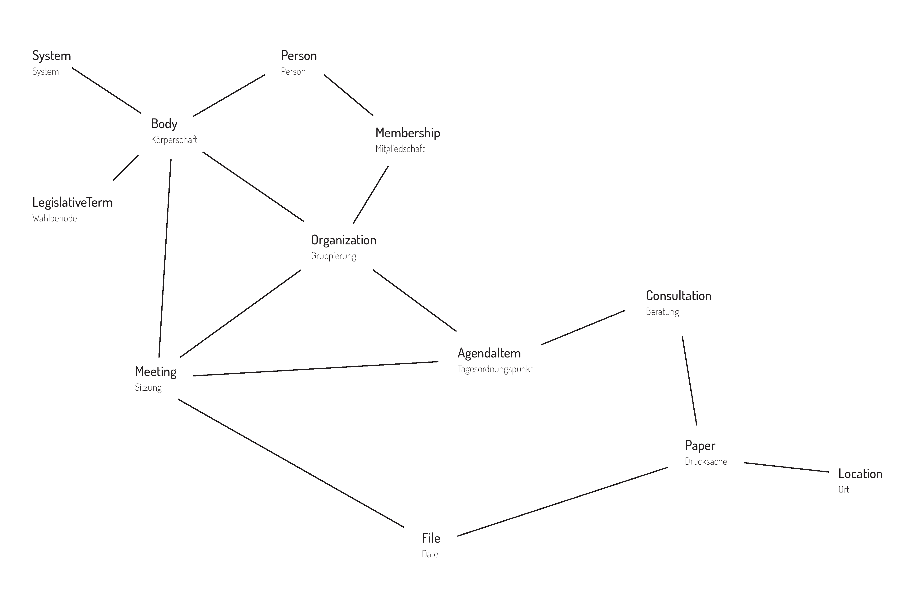

Schema
======

Dieses Kapitel beschreibt das Schema von OParl. Das Schema bildet das
Datenmodell der OParl-Architektur ab. Es definiert, welche Objekttypen
über eine OParl-API abgerufen werden können und welche Eigenschaften
diese Objekttypen haben dürfen und müssen. Darüber hinaus ist im Schema
auch festgelegt, in welcher Beziehung verschiedene Objekttypen zu
einander stehen.

Übergreifende Aspekte
---------------------

### Unicode-Zeichenketten als Standard  {#unicode_zeichenketten}

Die Schema-Beschreibung gibt zu jeder Eigenschaft eines Objekttypen an,
welchen Typ der Wert dieser Eigenschaft haben muss.

Sofern keine Typ-Angabe zu einer Eigenschaft vorhanden ist, oder die
Typ-Angabe `String` oder `xsd:string` lautet, werden Unicode-Zeichenketten
als Datentyp erwartet.

### `null`-Werte und "leere" Werte

JSON erlaubt es grundsätzlich, Eigenschaften mit dem Wert `null` zu versehen.
Im Rahmen dieser Spezifikation DARF das bei durch einen _Server_ gelieferten 
Objekten nur dann der Fall sein, wenn es gemäß JSON-LD-Spezifikation
erfolgt. Das gilt auch für OPTIONALE oder EMPFOHLENE Eigenschaften.

Ein _Client_ MUSS `null`-Werte tolerieren und SOLL diese Eigenschaften
nicht anders anzeigen, als nicht vorhandene Eigenschaften.

Entsprechendes gilt für leere Wertemengen oder -listen, also `[]`, und leere
Objekte, also `{}`.

Dafür gibt es zwei Gründe. Einerseits wird dadurch die Umgehung des Zwangs zur
Angabe von Werten bei ZWINGENDEN Eigenschaften ausgeschlossen. Andererseits
enthalten solche Leerkonstruktionen keine verwendbare Information.

### URLs der Eigenschaften

Jede Eigenschaft ist unter einer URL identifizierbar.

### Verwendung externer Eigenschaften / abgeleitete Eigenschaften

Verschiedene Eigenschaften sind nicht in OParl selbst definiert, sondern
in anderen externen Vokabularen. Dabei legt die Oparl-Spezifikation jeweils
fest, ob die Original-Eigenschaft verwendet wird oder ob für OParl eine
abgeleitete Eigenschaft verwendet wird.

So ist für eine Eigenschaft `classification" von Gruppierungen eine
Verwendung von `org:classification` ebenso denkbar wir die Verwendung von
`oparl:classification`. Im zweiten Fall wird die Eigenschaft als
Untereigenschaft der Ausgangseigenschaft definiert. Die Ausgangseigenschaft
wird dann jeweils hinter "Abgeleitet von:" angeben.

Auf die Bedeutung dieses Unterschiedes und der Untereigenschafts-Beziehung
wird an dieser Stelle nicht weiter eingegangen  Stichwort: `owl:subPropertyOf`).
Unterschiede kann es z.B. bei den Wertebereichen geben.

Der Name der Ausdgangseigenschaft muss nicht übernommen werden.
In OParl wird aber in der Regel der jeweilige Ausgangsname verwendet.

### Kardinalität

Viele Eigenschaften erlauben es, entweder einen einzelnen Wert (z. B. eine Zeichenkette,
eine URL, eine Zahl) oder alternativ eine Liste mit mehreren Elementen des
jeweils erlaubten Typs auszugeben. Die entsprechende Regel ist in der Schema-Beschreibung
unter dem Stichwort *Kardinalität* angegeben. Dabei sind verschiedene Angaben
zur Eigenschaft möglich:

* 0 bis 1: OPTIONAL und MUSS NICHT gesetzt sein. Wenn sie gesetzt ist,
  DARF sie genau einen Wert haben.

* 1: MUSS gesetzt sein und genau einen Wert haben.

* 0 bis *: OPTIONAL und MUSS NICHT gesetzt sein. Wenn sie gesetzt ist,
  DARF sie beliebig viele Werte haben.

* 1 bis *: MUSS vorhanden sein, es MUSS mindestens ein Wert gesetzt sein.
  Es DÜRFEN auch mehrere Werte vorhanden sein.

Zur Ausgabe von Listen innerhalb eines Objekts sowie über eigene URLs finden sich
ausführlichere Erläuterungen im Abschnitt [Objektlisten](#objektlisten).

### Datums- und Zeitangaben

Für Datum und Zeit werden die in XML-Schema festgelegten Typen verwendet
(was nicht bedeutet, dass in OParl XML verwendet wird).

Für ein Datum wird http://www.w3.org/TR/xmlschema-2/#date verwendet und
für eine Zeit http://www.w3.org/TR/xmlschema-2/#dateTime. Dabei wird ein
Datum (ein Tag ohne Uhrzeit) ohne Zeitzone und ein Datum mit Zeit mit
Zeitzone angegeben, denn nur damit ist die Uhrzeit weltweit eindeutig
ohne zusätzlich auf den Ort einer Sitzung o. ä. Bezug nehmen zu müssen.

Diese Spezifikationen stützen sich auf RFC 3339^[RFC3339:
<http://www.ietf.org/rfc/rfc3339.txt>]) und RFC 3339 wiederum auf ISO 8601.

Im JSON-LD Kontext von OParl ist der Präfix `xsd` so spezifiziert, dass 
Datums- und Zeittyp durch `xsd:date` bzw. `xsd:dateTime` abgekürzt werden 
können.

### Mehrsprachigkeit

Für Texte in OParl-Objekten ist durchgehend vorgesehen, dass diese 
mehrsprachig sein können. JSON-LD sieht das Schlüsselwort
`@language` vor, um zu einem Attribut mehrere Werte in bestimmten
Sprachen zu definieren. Diesen Mechanismus SOLLEN Server-Implementierer
nutzen, um Mehrsprachigkeit von Inhalten zu realisieren.

In den von OParl bereitgestellten JSON-LD-Kontexten ist die deutsche Sprache
(Kürzel `de`) für sämtliche Texteigenschaften voreingestellt. Das `@language`
Stichwort SOLL daher nur dann eingesetzt werden, wenn ein Inhalt nicht
deutschsprachig ist.

### Vokabulare zur Klassifizierung  {#vokabulare_klassifizierung}

Einige Objekttypen besitzen Eigenschaften zum Zweck der Klassifizierung von Objekten.
Im Einzelnen sind dies:

* die Eigenschaft `paperType` des Objekttyps [`oparl:Paper`](#oparl_paper)
* die Eigenschaft `documentRole` des Objekttyps [`oparl:File`](#oparl_document)
* die Eigenschaft `classification` des Objekttyps [`oparl:Organization`](#oparl_organization)
* die Eigenschaft `result` des Objekttyps [`oparl:AgendaItem`](#oparl_agendaitem)
* die Eigenschaft `status` des Objekttyps [`oparl:Person`](#oparl_person)
* die Eigenschaft `title` des Objekttyps [`oparl:Person`](#oparl_person)
* die Eigenschaft `role` des Objekttyps [`oparl:Membership`](#oparl_membership)
* die Eigenschaft `keyword` in mehreren Objekttypen

Diese Eigenschaften können wahlweise mit einfachen Zeichenketten befüllt werden
(z. B. "Beantwortung einer Anfrage") oder mit URLs zu Begriffen aus
Vokabularen. Ein Begriff SOLL, wenn er per URL referenziert wird,
in Form eines `skos:Concept` Objekts vorliegen, das über eine `skos:prefLabel`
Eigenschaft verfügt. Diese Konstrukte entstammen dem _Simple Knowledge
Organization System_ (SKOS).^[SKOS: <http://www.w3.org/2009/08/skos-reference/skos.html>]

Die Verwendung eines übergreifenden Vokabulars soll dazu beitragen, dass
die automatisierte Auswertung von parlamentarischen Informationen über die
Grenzen einzelner Systeme hinweg deutlich erleichtert wird. So könnte
beispielsweise eine bestimmte Art von Antrag über Systemgrenzen hinweg als
solcher erkannt werden, wenn die Systeme auf das selbe `skos:Concept`
verweisen.

Zukünftig ist vorstellbar, dass OParl hierzu Vokabulare mit entsprechenden
SKOS-Objekten zur Verfügung stellt, die dann von Datenanbietern per URL
referenziert werden können.

### Herstellerspezifische Erweiterungen

Diese sind – falls tatsächlich erforderlich – mit den JSON-LD-Mitteln einfach möglich. Z. B.

~~~~~
"herstellera:newWonderProperty": "Dies ist ein Feature,
    welches noch kein anderer Hersteller bietet!"
~~~~~

### URL-Pfade in den Beispielen

OParl-Clients wissen *nichts* vom Aufbau von Pfaden innerhalb von URLs,
müssen dies nicht wissen, und es gibt deshalb in der OParl-Spezifikation
*keine* Festlegungen dazu.

Wenn der Betreiber eines OParl-Systems beispielsweise meint, dass eine
Person eine eigene Domain verdient, dann ist dies aus Sicht der OParl-Spezifikation
völlig in Ordnung:

~~~~~~~~~~
https://ratsmitglied-max-mustermann.example.org/mein-oparl-datensatz
~~~~~~~~~~

Noch etwas extremer: selbst eine eigene Domain für jedes einzelne 
OParl-Objekt würde der OParl-Spezifikation nicht widersprechen.

Wenn also in einer Beispiel-URL so etwas wie

~~~~~~~~~~
bodies/0/peoples/
~~~~~~~~~~

auftaucht, dann bedeutet das nicht, dass genau solche Pfade durch
die OParl-Spezifikation vorgeschrieben sind.

Auch dies wäre als absoluter Link z. B. für eine Person verwendbar:

~~~~~~~~~~
https://www.ratsinfomanagement.net/personen/?__=LfyIfvCWq8SpBQj0MiyHaxDZwGJ
~~~~~~~~~~

Dies käme dann als relativer Link für die Person in Frage:

~~~~~~~~~~
personen/?__=LfyIfvCWq8SpBQj0MiyHaxDZwGJ
~~~~~~~~~~

oder auch z. B. dies
~~~~~~~~~~
 LfyIfvCWq8SpBQj0MiyHaxDZwGJ
~~~~~~~~~~

Gleichzeitig ist aber aus verschiedenen Gründen ein strukturierter Aufbau
der Pfade durchaus sinnvoll, der sich an der Hierarchie der Objekte
orientiert (nicht zuletzt, weil dies Softwareentwicklern während der
Entwicklung helfen kann). Dennoch wird eine solche Struktur bewusst
nicht in OParl festgelegt.
