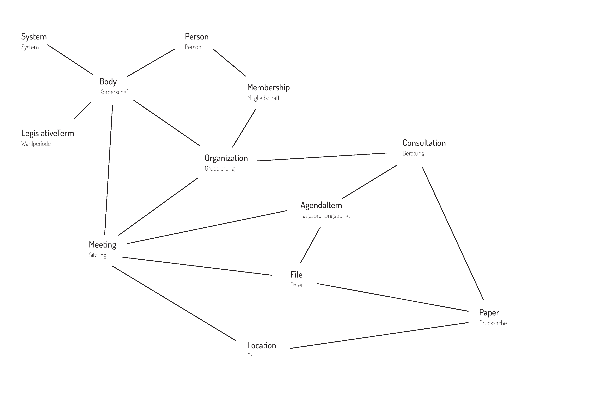

# Schema {#schema}

Dieses Kapitel beschreibt das Schema von OParl. Das Schema bildet das
Datenmodell der OParl-Architektur ab. Es definiert, welche Objekttypen
über eine OParl-API abgerufen werden können und welche Eigenschaften
diese Objekttypen haben dürfen und müssen. Darüber hinaus ist im Schema
auch festgelegt, in welcher Beziehung verschiedene Objekttypen zu
einander stehen.

## Übergreifende Aspekte {#uebergreifende-aspekte}

### Vollständigkeit {#schema-vollstaendigkeit}

Alle regulär öffentlich abrufbaren Informationen SOLLEN auch in OParl ausgegeben werden, solange dies nicht den Datenschutzbestimmungen widerspricht. Daher sind sämtliche Felder im Schema als EMPFOHLEN zu behandeln, wenn nicht explizit etwas anderes angegeben wurde.

### `null`-Werte und leere Listen {#null-werte-und-leere-listen}

JSON erlaubt es grundsätzlich, Eigenschaften mit dem Wert `null` zu versehen.
Im Rahmen von OParl SOLLEN Server nach Möglichkeit davon absehen, Eigenschaften
mit dem Wert `null` auszugeben. Obligatorische Eigenschaften (in diesem Kapitel mit "ZWINGEND" markiert) DÜRFEN NICHT den Wert `null` haben.

Im Fall von Arrays erlaubt JSON grundsätzlich die Ausgabe von `[]` für leere Arrays.
Wie bei `null` wird auch hier EMPFOHLEN, auf die Ausgabe einer Eigenschaft mit dem Wert `[]` zu verzichten, sofern es sich nicht um eine obligatorische Eigenschaft handelt.

Obligatorische Eigenschaften, die als Wert eine Liste von Objekten haben können,
stellen einen Sonderfall dar. Diese können, wie im Abschnitt
[Objektlisten](#objektlisten) beschrieben, entweder ein JSON-Array oder eine
URL zum externen Abruf einer Objektliste als Wert haben. In der Praxis kann es
vorkommen, dass solche Listen leer sind. Beispielsweise könnte eine Gruppierung
neu erstellt worden sein und noch keine Sitzungstermine aufweisen. In diesem
Fall ist ein leeres Array die richtige Möglichkeit, dies auszudrücken. Da es sich
dabei um eine obligatorische Eigenschaft handelt, MUSS sie jedoch ausgegeben werden.

Beispiel:

~~~~~  {#schema_ex1 .json}
{
    "id": "https://oparl.example.org/",
    "type": "http://oparl.org/schema/1.0/Organization",
    "meeting": [],
    ...
}
~~~~~

Clients können so unmittelbar feststellen, dass zu dieser Gruppierung (noch) keine
Sitzungen vorliegen.

Ist eine Liste leer, wird EMPFOHLEN, diese NICHT über eine eigene URL anzubieten,
da so Clients eine zusätzliche Anfrage für den Abruf einer leeren Liste stellen
müssen.

### Kardinalität {#kardinalitaet}

Zur expliziten Unterscheidung, ob eine Eigenschaft einen einzelnen Wert
(z. B. eine Zeichenkette, eine URL, eine Zahl) oder alternativ eine Liste mit
mehreren Elementen als Wert haben darf, ist in der Schema-Beschreibung 
zu jeder Eigenschaft die *Kardinalität* angegeben. Dabei sind verschiedene
Angaben zur Eigenschaft möglich:

* 0 bis 1: OPTIONAL und MUSS NICHT gesetzt sein. Wenn sie gesetzt ist,
  DARF sie genau einen Wert haben.

* 1: MUSS gesetzt sein und genau einen Wert haben.

* 0 bis *: OPTIONAL und MUSS NICHT gesetzt sein. Wenn sie gesetzt ist,
  DARF sie beliebig viele Werte haben.

* 1 bis *: MUSS vorhanden sein, es MUSS mindestens ein Wert gesetzt sein.
  Es DÜRFEN auch mehrere Werte vorhanden sein.

Zur Ausgabe von Listen innerhalb eines Objekts sowie über eigene URLs finden sich
ausführlichere Erläuterungen im Abschnitt [Objektlisten](#objektlisten).

### Datums- und Zeitangaben  {#datum_zeit}

Für Datum und Zeit werden die in XML-Schema festgelegten Typen verwendet
(was nicht bedeutet, dass in OParl XML verwendet wird).

Für ein Datum wird http://www.w3.org/TR/xmlschema-2/#date verwendet und
für eine Zeit http://www.w3.org/TR/xmlschema-2/#dateTime. Dabei wird ein
Datum (ein Tag ohne Uhrzeit) ohne Zeitzone und ein Datum mit Zeit mit
Zeitzone angegeben, denn nur damit ist die Uhrzeit weltweit eindeutig
ohne zusätzlich auf den Ort einer Sitzung o. ä. Bezug nehmen zu müssen.

Diese Spezifikationen stützen sich auf RFC 3339^[RFC3339:
<http://www.ietf.org/rfc/rfc3339.txt>]) und RFC 3339 wiederum auf ISO 8601.

### Herstellerspezifische Erweiterungen {#herstellerspezifische-erweiterungen}

Diese sind – falls tatsächlich erforderlich – mit den JSON-LD-Mitteln einfach möglich. Z. B.

~~~~~
"herstellera:newWonderProperty": "Dies ist ein Feature,
    welches noch kein anderer Hersteller bietet!",
"herstellerb:faxNumber": "012345678"
~~~~~

Das Zeichen '@' DARF NICHT als Bestandteil des Herstellerprefix verwendet werden,
um eine ggf. später aufkommende JSON-LD-Erweiterung nicht zu stören.

### URL-Pfade in den Beispielen {#url-pfade-in-den-beispielen}

OParl-Clients wissen *nichts* vom Aufbau von Pfaden innerhalb von URLs,
müssen dies nicht wissen, und es gibt deshalb in der OParl-Spezifikation
*keine* Festlegungen dazu.

Wenn der Betreiber eines OParl-Systems beispielsweise meint, dass eine
Person eine eigene Domain verdient, dann ist dies aus Sicht der OParl-Spezifikation
völlig in Ordnung:

    https://ratsherr-mustermann.example.org/

Noch etwas extremer: selbst eine eigene Domain für jedes einzelne 
OParl-Objekt würde der OParl-Spezifikation nicht widersprechen.

Wenn also in einer Beispiel-URL ein Pfad wie

    bodies/0/peoples/

auftaucht, bedeutet das nicht, dass genau solche Pfade durch
die OParl-Spezifikation vorgeschrieben sind.

Auch dies wäre als URL z. B. für eine Person verwendbar:

    https://www.ratsinfo.net/personen/?__=LfyIfvCWq8SpBQj0MiyHaxDZwGJ

Gleichzeitig ist aber aus verschiedenen Gründen ein strukturierter Aufbau
der Pfade durchaus sinnvoll, der sich an der Hierarchie der Objekte
orientiert (nicht zuletzt, weil dies Softwareentwicklern während der
Entwicklung helfen kann). Dennoch wird eine solche Struktur bewusst
nicht in OParl festgelegt.
